# AsynCodeBench 20-task dependency catalog

This catalog enumerates the 56 frozen dependency points in the v0.4 20-task release. Direction is always `producer → consumer`; labels are preserved from each task's canonical async-metrics annotation.

Each SVG is a node-based dependency graph: a canonical subproblem/artifact appears once, its owned file set is shown inside the node, and all contracts reuse that node. This makes fan-out, fan-in, chains, parallel contracts, and cycles visible without duplicating producer or consumer boxes.

## Taxonomy and totals

| Code | Frozen dependency type | Count |
| --- | --- | ---: |
| IF | Interface Dependency (`interface_dependency`) | 22 |
| API | Shared API Contract (`shared_api_contract`) | 18 |
| STATE | Shared State Contract (`shared_state_contract`) | 7 |
| INT | Integration Contract (`integration_contract`) | 9 |
| **Total** |  | **56** |

Interpretation follows the paper distinction: IF is direct interface consumption; API is preservation of the same externally visible behavior across layers; STATE requires agreement about state representation or lifecycle across time; INT requires successful composition at an end-to-end boundary.

## Task overview

| # | Task | Edges | IF | API | STATE | INT |
| ---: | --- | ---: | ---: | ---: | ---: | ---: |
| 1 | [cachetools](#cachetools) | 5 | 3 | 2 | 0 | 0 |
| 2 | [deprecated](#deprecated) | 3 | 1 | 0 | 0 | 2 |
| 3 | [portalocker](#portalocker) | 3 | 1 | 1 | 0 | 1 |
| 4 | [tinydb](#tinydb) | 3 | 1 | 1 | 1 | 0 |
| 5 | [wcwidth](#wcwidth) | 2 | 1 | 0 | 0 | 1 |
| 6 | [requests](#requests) | 3 | 2 | 1 | 0 | 0 |
| 7 | [simpy](#simpy) | 3 | 2 | 1 | 0 | 0 |
| 8 | [parsel](#parsel) | 2 | 1 | 1 | 0 | 0 |
| 9 | [filesystem_spec](#filesystem-spec) | 3 | 1 | 2 | 0 | 0 |
| 10 | [marshmallow](#marshmallow) | 3 | 1 | 1 | 1 | 0 |
| 11 | [graphene](#graphene) | 3 | 1 | 2 | 0 | 0 |
| 12 | [imapclient](#imapclient) | 3 | 1 | 1 | 1 | 0 |
| 13 | [pexpect](#pexpect) | 3 | 1 | 1 | 1 | 0 |
| 14 | [flask](#flask) | 3 | 1 | 0 | 1 | 1 |
| 15 | [python-rsa](#python-rsa) | 3 | 1 | 1 | 0 | 1 |
| 16 | [cookiecutter](#cookiecutter) | 3 | 1 | 0 | 1 | 1 |
| 17 | [apache-tvm-20018](#apache-tvm-20018) | 2 | 1 | 0 | 0 | 1 |
| 18 | [apache-tvm-20073](#apache-tvm-20073) | 2 | 1 | 0 | 1 | 0 |
| 19 | [apache-tvm-20107](#apache-tvm-20107) | 2 | 0 | 2 | 0 | 0 |
| 20 | [apache-tvm-20153](#apache-tvm-20153) | 2 | 0 | 1 | 0 | 1 |

## Paper-definition audit flags

The release labels below remain unchanged. Before treating the four classes as a paper taxonomy, the following three edges deserve explicit adjudication against the sharper IF/API/STATE decision rules:

- `simpy.events_to_resources.request_trigger_contract` — Frozen as API. Because the contract explicitly covers triggered/processed state, callbacks, and process resumption across time, STATE may be the cleaner label under the lifecycle rule.
- `imapclient.lexer_to_parser.token_literal_contract` — Frozen as API. The parser directly consumes lexer tokens and literal semantics; if no second layer must reproduce the same public behavior, this is more naturally IF.
- `imapclient.utility_to_client.command_normalization_contract` — Frozen as STATE. The registered probes exercise one-shot date/UTF-7 normalization, not a read-write-invalidate-reread lifecycle; IF is more natural unless additional persistent-state evidence is documented.

Changing any frozen label requires rebuilding the affected metrics artifact and release hashes; this generated catalog does not do that.

## Per-task dependencies

### 1. cachetools

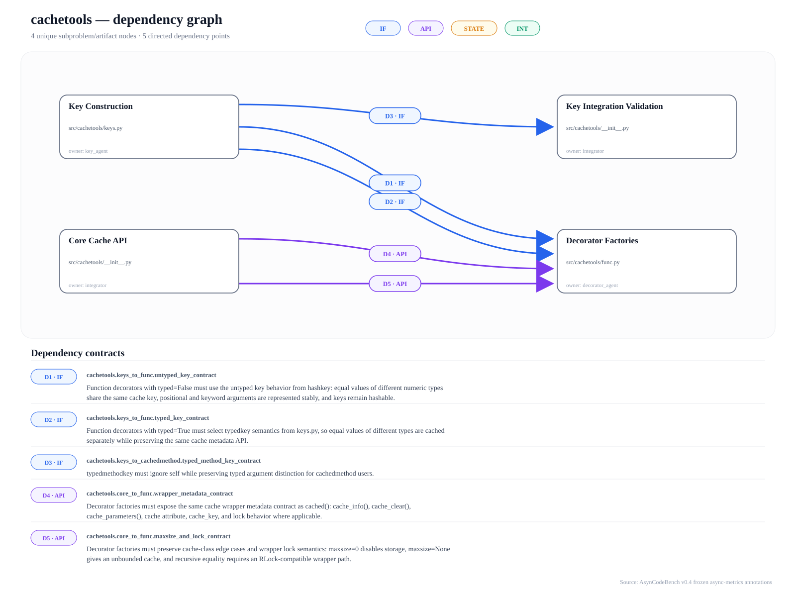

Canonical annotation: [`manifests/pilot/v0.3/metrics/commit0_cachetools_async_metrics.json`](../../manifests/pilot/v0.3/metrics/commit0_cachetools_async_metrics.json)

#### D1. cachetools.keys_to_func.untyped_key_contract [IF]

- Direction: `key_construction` → `decorator_factories`
- Ownership: `key_agent` → `decorator_agent`
- Contract: Function decorators with typed=False must use the untyped key behavior from hashkey: equal values of different numeric types share the same cache key, positional and keyword arguments are represented stably, and keys remain hashable.
- Resolution: Resolved when the upstream hashkey probe and the required untyped decorator probes all pass in the integrated workspace.

<details>
<summary>Exact checker mapping</summary>

**Upstream (1)**

- `tests/test_keys.py::CacheKeysTest::test_hashkey`

**Downstream (12)**

- `tests/test_func.py::FIFODecoratorTest::test_decorator`
- `tests/test_func.py::LFUDecoratorTest::test_decorator`
- `tests/test_func.py::LRUDecoratorTest::test_decorator`
- `tests/test_func.py::MRUDecoratorTest::test_decorator`
- `tests/test_func.py::RRDecoratorTest::test_decorator`
- `tests/test_func.py::TTLDecoratorTest::test_decorator`
- `tests/test_func.py::FIFODecoratorTest::test_decorator_user_function`
- `tests/test_func.py::LFUDecoratorTest::test_decorator_user_function`
- `tests/test_func.py::LRUDecoratorTest::test_decorator_user_function`
- `tests/test_func.py::MRUDecoratorTest::test_decorator_user_function`
- `tests/test_func.py::RRDecoratorTest::test_decorator_user_function`
- `tests/test_func.py::TTLDecoratorTest::test_decorator_user_function`

**Integrated (7)**

- `tests/test_keys.py::CacheKeysTest::test_hashkey`
- `tests/test_func.py::FIFODecoratorTest::test_decorator`
- `tests/test_func.py::LFUDecoratorTest::test_decorator`
- `tests/test_func.py::LRUDecoratorTest::test_decorator`
- `tests/test_func.py::MRUDecoratorTest::test_decorator`
- `tests/test_func.py::RRDecoratorTest::test_decorator`
- `tests/test_func.py::TTLDecoratorTest::test_decorator`

</details>

#### D2. cachetools.keys_to_func.typed_key_contract [IF]

- Direction: `key_construction` → `decorator_factories`
- Ownership: `key_agent` → `decorator_agent`
- Contract: Function decorators with typed=True must select typedkey semantics from keys.py, so equal values of different types are cached separately while preserving the same cache metadata API.
- Resolution: Resolved when typedkey passes and every typed decorator probe passes after integrating key and decorator artifacts.

<details>
<summary>Exact checker mapping</summary>

**Upstream (1)**

- `tests/test_keys.py::CacheKeysTest::test_typedkey`

**Downstream (6)**

- `tests/test_func.py::FIFODecoratorTest::test_decorator_typed`
- `tests/test_func.py::LFUDecoratorTest::test_decorator_typed`
- `tests/test_func.py::LRUDecoratorTest::test_decorator_typed`
- `tests/test_func.py::MRUDecoratorTest::test_decorator_typed`
- `tests/test_func.py::RRDecoratorTest::test_decorator_typed`
- `tests/test_func.py::TTLDecoratorTest::test_decorator_typed`

**Integrated (7)**

- `tests/test_keys.py::CacheKeysTest::test_typedkey`
- `tests/test_func.py::FIFODecoratorTest::test_decorator_typed`
- `tests/test_func.py::LFUDecoratorTest::test_decorator_typed`
- `tests/test_func.py::LRUDecoratorTest::test_decorator_typed`
- `tests/test_func.py::MRUDecoratorTest::test_decorator_typed`
- `tests/test_func.py::RRDecoratorTest::test_decorator_typed`
- `tests/test_func.py::TTLDecoratorTest::test_decorator_typed`

</details>

#### D3. cachetools.keys_to_cachedmethod.typed_method_key_contract [IF]

- Direction: `key_construction` → `key_integration_validation`
- Ownership: `key_agent` → `integrator`
- Contract: typedmethodkey must ignore self while preserving typed argument distinction for cachedmethod users.
- Resolution: Resolved when typedmethodkey and cachedmethod typed-method probes pass in the integrated workspace.

<details>
<summary>Exact checker mapping</summary>

**Upstream (1)**

- `tests/test_keys.py::CacheKeysTest::test_typedmethodkey`

**Downstream (2)**

- `tests/test_cachedmethod.py::CachedMethodTest::test_typedmethod_dict`
- `tests/test_cachedmethod.py::CachedMethodTest::test_typedmethod_lru`

**Integrated (3)**

- `tests/test_keys.py::CacheKeysTest::test_typedmethodkey`
- `tests/test_cachedmethod.py::CachedMethodTest::test_typedmethod_dict`
- `tests/test_cachedmethod.py::CachedMethodTest::test_typedmethod_lru`

</details>

#### D4. cachetools.core_to_func.wrapper_metadata_contract [API]

- Direction: `core_cache_api` → `decorator_factories`
- Ownership: `integrator` → `decorator_agent`
- Contract: Decorator factories must expose the same cache wrapper metadata contract as cached(): cache_info(), cache_clear(), cache_parameters(), cache attribute, cache_key, and lock behavior where applicable.
- Resolution: Resolved when decorator wrappers expose cache metadata and clear behavior consistently across all cache factory variants.

<details>
<summary>Exact checker mapping</summary>

**Upstream (4)**

- `tests/test_cached.py::CacheWrapperTest::test_decorator_attributes`
- `tests/test_cached.py::CacheWrapperTest::test_decorator_clear`
- `tests/test_cached.py::DictWrapperTest::test_decorator_attributes`
- `tests/test_cached.py::DictWrapperTest::test_decorator_clear`

**Downstream (12)**

- `tests/test_func.py::FIFODecoratorTest::test_decorator_clear`
- `tests/test_func.py::LFUDecoratorTest::test_decorator_clear`
- `tests/test_func.py::LRUDecoratorTest::test_decorator_clear`
- `tests/test_func.py::MRUDecoratorTest::test_decorator_clear`
- `tests/test_func.py::RRDecoratorTest::test_decorator_clear`
- `tests/test_func.py::TTLDecoratorTest::test_decorator_clear`
- `tests/test_func.py::FIFODecoratorTest::test_decorator_user_function`
- `tests/test_func.py::LFUDecoratorTest::test_decorator_user_function`
- `tests/test_func.py::LRUDecoratorTest::test_decorator_user_function`
- `tests/test_func.py::MRUDecoratorTest::test_decorator_user_function`
- `tests/test_func.py::RRDecoratorTest::test_decorator_user_function`
- `tests/test_func.py::TTLDecoratorTest::test_decorator_user_function`

**Integrated (6)**

- `tests/test_func.py::FIFODecoratorTest::test_decorator_clear`
- `tests/test_func.py::LFUDecoratorTest::test_decorator_clear`
- `tests/test_func.py::LRUDecoratorTest::test_decorator_clear`
- `tests/test_func.py::MRUDecoratorTest::test_decorator_clear`
- `tests/test_func.py::RRDecoratorTest::test_decorator_clear`
- `tests/test_func.py::TTLDecoratorTest::test_decorator_clear`

</details>

#### D5. cachetools.core_to_func.maxsize_and_lock_contract [API]

- Direction: `core_cache_api` → `decorator_factories`
- Ownership: `integrator` → `decorator_agent`
- Contract: Decorator factories must preserve cache-class edge cases and wrapper lock semantics: maxsize=0 disables storage, maxsize=None gives an unbounded cache, and recursive equality requires an RLock-compatible wrapper path.
- Resolution: Resolved when no-cache, unbounded-cache, and RLock-sensitive decorator probes pass after integration.

<details>
<summary>Exact checker mapping</summary>

**Upstream (2)**

- `tests/test_cached.py::CacheWrapperTest::test_zero_size_cache_decorator`
- `tests/test_cached.py::CacheWrapperTest::test_zero_size_cache_decorator_lock`

**Downstream (18)**

- `tests/test_func.py::FIFODecoratorTest::test_decorator_nocache`
- `tests/test_func.py::LFUDecoratorTest::test_decorator_nocache`
- `tests/test_func.py::LRUDecoratorTest::test_decorator_nocache`
- `tests/test_func.py::MRUDecoratorTest::test_decorator_nocache`
- `tests/test_func.py::RRDecoratorTest::test_decorator_nocache`
- `tests/test_func.py::TTLDecoratorTest::test_decorator_nocache`
- `tests/test_func.py::FIFODecoratorTest::test_decorator_unbound`
- `tests/test_func.py::LFUDecoratorTest::test_decorator_unbound`
- `tests/test_func.py::LRUDecoratorTest::test_decorator_unbound`
- `tests/test_func.py::MRUDecoratorTest::test_decorator_unbound`
- `tests/test_func.py::RRDecoratorTest::test_decorator_unbound`
- `tests/test_func.py::TTLDecoratorTest::test_decorator_unbound`
- `tests/test_func.py::FIFODecoratorTest::test_decorator_needs_rlock`
- `tests/test_func.py::LFUDecoratorTest::test_decorator_needs_rlock`
- `tests/test_func.py::LRUDecoratorTest::test_decorator_needs_rlock`
- `tests/test_func.py::MRUDecoratorTest::test_decorator_needs_rlock`
- `tests/test_func.py::RRDecoratorTest::test_decorator_needs_rlock`
- `tests/test_func.py::TTLDecoratorTest::test_decorator_needs_rlock`

**Integrated (15)**

- `tests/test_func.py::FIFODecoratorTest::test_decorator_nocache`
- `tests/test_func.py::LFUDecoratorTest::test_decorator_nocache`
- `tests/test_func.py::LRUDecoratorTest::test_decorator_nocache`
- `tests/test_func.py::RRDecoratorTest::test_decorator_nocache`
- `tests/test_func.py::TTLDecoratorTest::test_decorator_nocache`
- `tests/test_func.py::FIFODecoratorTest::test_decorator_unbound`
- `tests/test_func.py::LFUDecoratorTest::test_decorator_unbound`
- `tests/test_func.py::LRUDecoratorTest::test_decorator_unbound`
- `tests/test_func.py::RRDecoratorTest::test_decorator_unbound`
- `tests/test_func.py::TTLDecoratorTest::test_decorator_unbound`
- `tests/test_func.py::FIFODecoratorTest::test_decorator_needs_rlock`
- `tests/test_func.py::LFUDecoratorTest::test_decorator_needs_rlock`
- `tests/test_func.py::LRUDecoratorTest::test_decorator_needs_rlock`
- `tests/test_func.py::RRDecoratorTest::test_decorator_needs_rlock`
- `tests/test_func.py::TTLDecoratorTest::test_decorator_needs_rlock`

</details>

### 2. deprecated

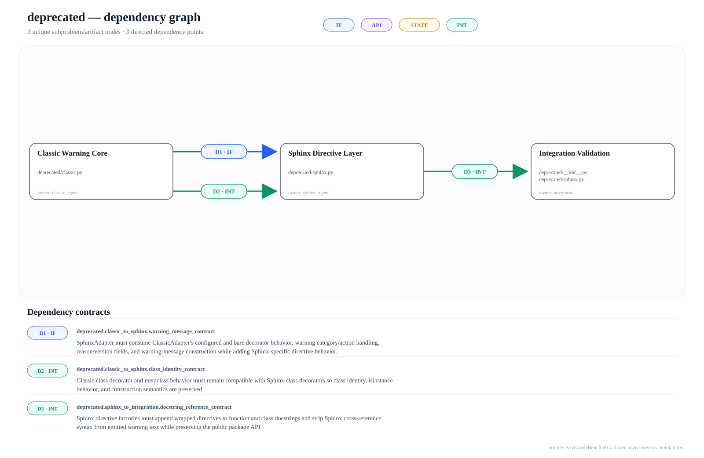

Canonical annotation: [`manifests/pilot/v0.3/metrics/commit0_deprecated_async_metrics.json`](../../manifests/pilot/v0.3/metrics/commit0_deprecated_async_metrics.json)

#### D1. deprecated.classic_to_sphinx.warning_message_contract [IF]

- Direction: `classic_warning_core` → `sphinx_directive_layer`
- Ownership: `classic_agent` → `sphinx_agent`
- Contract: SphinxAdapter must consume ClassicAdapter's configured and bare decorator behavior, warning category/action handling, reason/version fields, and warning-message construction while adding Sphinx-specific directive behavior.
- Resolution: Resolved when classic warning-message, classmethod descriptor, and Sphinx deprecated-warning probes pass in the integrated workspace.

<details>
<summary>Exact checker mapping</summary>

**Upstream (4)**

- `tests/test_deprecated.py::test_classic_deprecated_function__warns`
- `tests/test_deprecated.py::test_classic_deprecated_class_method__warns`
- `tests/test_deprecated.py::test_warning_msg_has_reason`
- `tests/test_deprecated.py::test_specific_warning_cls_is_used`

**Downstream (4)**

- `tests/test_sphinx.py::test_sphinx_deprecated_function__warns`
- `tests/test_sphinx.py::test_sphinx_deprecated_class_method__warns`
- `tests/test_sphinx.py::test_warning_msg_has_reason`
- `tests/test_sphinx.py::test_specific_warning_cls_is_used`

**Integrated (7)**

- `tests/test_deprecated.py::test_classic_deprecated_function__warns`
- `tests/test_deprecated.py::test_classic_deprecated_class_method__warns`
- `tests/test_deprecated.py::test_warning_msg_has_reason`
- `tests/test_sphinx.py::test_sphinx_deprecated_function__warns`
- `tests/test_sphinx.py::test_sphinx_deprecated_class_method__warns`
- `tests/test_sphinx.py::test_warning_msg_has_reason`
- `tests/test_sphinx.py::test_specific_warning_cls_is_used`

</details>

#### D2. deprecated.classic_to_sphinx.class_identity_contract [INT]

- Direction: `classic_warning_core` → `sphinx_directive_layer`
- Ownership: `classic_agent` → `sphinx_agent`
- Contract: Classic class decorator and metaclass behavior must remain compatible with Sphinx class decorators so class identity, isinstance behavior, and construction semantics are preserved.
- Resolution: Resolved when classic class/metaclass probes and Sphinx class-identity probes pass after integration.

<details>
<summary>Exact checker mapping</summary>

**Upstream (2)**

- `tests/test_deprecated_class.py::test_class_deprecation_using_deprecated_decorator`
- `tests/test_deprecated_metaclass.py::test_with_metaclass`

**Downstream (3)**

- `tests/test_sphinx_class.py::test_isinstance_deprecated`
- `tests/test_sphinx_class.py::test_isinstance_versionadded_versionchanged`
- `tests/test_sphinx.py::test_sphinx_deprecated_class__warns`

**Integrated (4)**

- `tests/test_deprecated_class.py::test_class_deprecation_using_deprecated_decorator`
- `tests/test_deprecated_metaclass.py::test_with_metaclass`
- `tests/test_sphinx_class.py::test_isinstance_deprecated`
- `tests/test_sphinx.py::test_sphinx_deprecated_class__warns`

</details>

#### D3. deprecated.sphinx_to_integration.docstring_reference_contract [INT]

- Direction: `sphinx_directive_layer` → `integration_validation`
- Ownership: `sphinx_agent` → `integrator`
- Contract: Sphinx directive factories must append wrapped directives to function and class docstrings and strip Sphinx cross-reference syntax from emitted warning text while preserving the public package API.
- Resolution: Resolved when Sphinx adapter/directive probes and integrated docstring/reference probes pass in the final workspace.

<details>
<summary>Exact checker mapping</summary>

**Upstream (2)**

- `tests/test_sphinx_adapter.py::test_sphinx_adapter`
- `tests/test_sphinx_adapter.py::test_decorator_accept_line_length`

**Downstream (2)**

- `tests/test_sphinx.py::test_has_sphinx_docstring`
- `tests/test_sphinx.py::test_sphinx_syntax_trimming`

**Integrated (4)**

- `tests/test_sphinx_adapter.py::test_sphinx_adapter`
- `tests/test_sphinx_adapter.py::test_decorator_accept_line_length`
- `tests/test_sphinx.py::test_has_sphinx_docstring`
- `tests/test_sphinx.py::test_sphinx_syntax_trimming`

</details>

### 3. portalocker

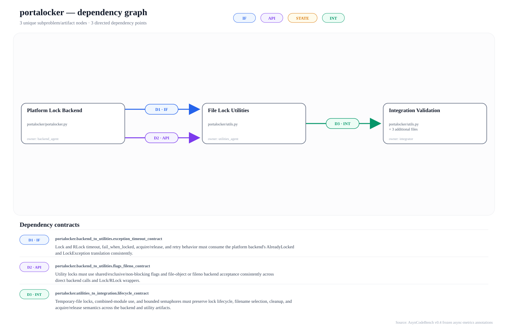

Canonical annotation: [`manifests/pilot/v0.3/metrics/commit0_portalocker_async_metrics.json`](../../manifests/pilot/v0.3/metrics/commit0_portalocker_async_metrics.json)

#### D1. portalocker.backend_to_utilities.exception_timeout_contract [IF]

- Direction: `platform_lock_backend` → `file_lock_utilities`
- Ownership: `backend_agent` → `utilities_agent`
- Contract: Lock and RLock timeout, fail_when_locked, acquire/release, and retry behavior must consume the platform backend's AlreadyLocked and LockException translation consistently.
- Resolution: Resolved when backend exception/conflict probes and utility timeout/acquire probes pass in the integrated workspace.

<details>
<summary>Exact checker mapping</summary>

**Upstream (3)**

- `portalocker_tests/tests.py::test_exceptions`
- `portalocker_tests/tests.py::test_simple`
- `portalocker_tests/tests.py::test_exlusive`

**Downstream (4)**

- `portalocker_tests/tests.py::test_with_timeout`
- `portalocker_tests/tests.py::test_without_fail`
- `portalocker_tests/tests.py::test_class`
- `portalocker_tests/tests.py::test_acquire_release`

**Integrated (5)**

- `portalocker_tests/tests.py::test_exceptions`
- `portalocker_tests/tests.py::test_simple`
- `portalocker_tests/tests.py::test_with_timeout`
- `portalocker_tests/tests.py::test_without_fail`
- `portalocker_tests/tests.py::test_acquire_release`

</details>

#### D2. portalocker.backend_to_utilities.flags_fileno_contract [API]

- Direction: `platform_lock_backend` → `file_lock_utilities`
- Ownership: `backend_agent` → `utilities_agent`
- Contract: Utility locks must use shared/exclusive/non-blocking flags and file-object or fileno backend acceptance consistently across direct backend calls and Lock/RLock wrappers.
- Resolution: Resolved when direct flag/fileno backend probes and wrapper flag/locker probes pass after integration.

<details>
<summary>Exact checker mapping</summary>

**Upstream (3)**

- `portalocker_tests/tests.py::test_shared`
- `portalocker_tests/tests.py::test_nonblocking`
- `portalocker_tests/tests.py::test_lock_fileno`

**Downstream (3)**

- `portalocker_tests/tests.py::test_blocking_timeout`
- `portalocker_tests/tests.py::test_locker_mechanism`
- `portalocker_tests/tests.py::test_rlock_acquire_release`

**Integrated (5)**

- `portalocker_tests/tests.py::test_shared`
- `portalocker_tests/tests.py::test_nonblocking`
- `portalocker_tests/tests.py::test_lock_fileno`
- `portalocker_tests/tests.py::test_blocking_timeout`
- `portalocker_tests/tests.py::test_locker_mechanism`

</details>

#### D3. portalocker.utilities_to_integration.lifecycle_contract [INT]

- Direction: `file_lock_utilities` → `integration_validation`
- Ownership: `utilities_agent` → `integrator`
- Contract: Temporary-file locks, combined-module use, and bounded semaphores must preserve lock lifecycle, filename selection, cleanup, and acquire/release semantics across the backend and utility artifacts.
- Resolution: Resolved when utility acquire/release probes and semaphore/temporary-file integration probes pass in the final workspace.

<details>
<summary>Exact checker mapping</summary>

**Upstream (2)**

- `portalocker_tests/tests.py::test_acquire_release`
- `portalocker_tests/tests.py::test_rlock_acquire_release_count`

**Downstream (3)**

- `portalocker_tests/temporary_file_lock.py::test_temporary_file_lock`
- `portalocker_tests/test_combined.py::test_combined`
- `portalocker_tests/test_semaphore.py::test_bounded_semaphore`

**Integrated (5)**

- `portalocker_tests/tests.py::test_acquire_release`
- `portalocker_tests/tests.py::test_rlock_acquire_release_count`
- `portalocker_tests/temporary_file_lock.py::test_temporary_file_lock`
- `portalocker_tests/test_combined.py::test_combined`
- `portalocker_tests/test_semaphore.py::test_bounded_semaphore`

</details>

### 4. tinydb

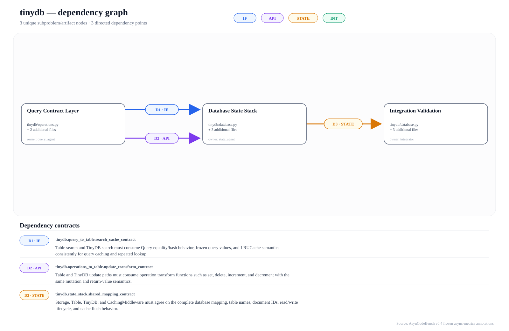

Canonical annotation: [`manifests/pilot/v0.3/metrics/commit0_tinydb_async_metrics.json`](../../manifests/pilot/v0.3/metrics/commit0_tinydb_async_metrics.json)

#### D1. tinydb.query_to_table.search_cache_contract [IF]

- Direction: `query_contract_layer` → `database_state_stack`
- Ownership: `query_agent` → `state_agent`
- Contract: Table search and TinyDB search must consume Query equality/hash behavior, frozen query values, and LRUCache semantics consistently for query caching and repeated lookup.
- Resolution: Resolved when query/cache producer probes and table/TinyDB query-cache consumer probes pass in the integrated workspace.

<details>
<summary>Exact checker mapping</summary>

**Upstream (4)**

- `tests/test_queries.py::test_eq`
- `tests/test_queries.py::test_hash`
- `tests/test_utils.py::test_lru_cache`
- `tests/test_utils.py::test_freeze`

**Downstream (3)**

- `tests/test_tables.py::test_query_cache`
- `tests/test_tables.py::test_lru_cache`
- `tests/test_tinydb.py::test_search`

**Integrated (5)**

- `tests/test_queries.py::test_eq`
- `tests/test_queries.py::test_hash`
- `tests/test_utils.py::test_lru_cache`
- `tests/test_tables.py::test_query_cache`
- `tests/test_tinydb.py::test_search`

</details>

#### D2. tinydb.operations_to_table.update_transform_contract [API]

- Direction: `query_contract_layer` → `database_state_stack`
- Ownership: `query_agent` → `state_agent`
- Contract: Table and TinyDB update paths must consume operation transform functions such as set, delete, increment, and decrement with the same mutation and return-value semantics.
- Resolution: Resolved when operation-function probes and TinyDB update consumer probes pass after integration.

<details>
<summary>Exact checker mapping</summary>

**Upstream (3)**

- `tests/test_operations.py::test_set`
- `tests/test_operations.py::test_increment`
- `tests/test_operations.py::test_delete`

**Downstream (3)**

- `tests/test_tinydb.py::test_update_transform`
- `tests/test_tinydb.py::test_update_multiple_operation`
- `tests/test_tinydb.py::test_update_returns_ids`

**Integrated (5)**

- `tests/test_operations.py::test_set`
- `tests/test_operations.py::test_increment`
- `tests/test_operations.py::test_delete`
- `tests/test_tinydb.py::test_update_transform`
- `tests/test_tinydb.py::test_update_multiple_operation`

</details>

#### D3. tinydb.state_stack.shared_mapping_contract [STATE]

- Direction: `database_state_stack` → `integration_validation`
- Ownership: `state_agent` → `integrator`
- Contract: Storage, Table, TinyDB, and CachingMiddleware must agree on the complete database mapping, table names, document IDs, read/write lifecycle, and cache flush behavior.
- Resolution: Resolved when storage/middleware probes and integrated TinyDB/table state probes pass in the final workspace.

<details>
<summary>Exact checker mapping</summary>

**Upstream (3)**

- `tests/test_storages.py::test_in_memory`
- `tests/test_storages.py::test_json_readwrite`
- `tests/test_middlewares.py::test_caching_write`

**Downstream (4)**

- `tests/test_tinydb.py::test_multiple_dbs`
- `tests/test_tinydb.py::test_drop_table`
- `tests/test_tinydb.py::test_storage_access`
- `tests/test_tables.py::test_multiple_tables`

**Integrated (6)**

- `tests/test_storages.py::test_in_memory`
- `tests/test_storages.py::test_json_readwrite`
- `tests/test_middlewares.py::test_caching_write`
- `tests/test_tinydb.py::test_multiple_dbs`
- `tests/test_tinydb.py::test_storage_access`
- `tests/test_tables.py::test_multiple_tables`

</details>

### 5. wcwidth

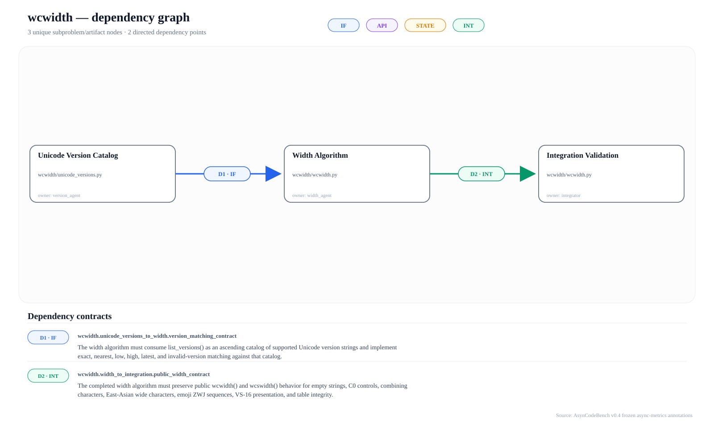

Canonical annotation: [`manifests/pilot/v0.3/metrics/commit0_wcwidth_async_metrics.json`](../../manifests/pilot/v0.3/metrics/commit0_wcwidth_async_metrics.json)

#### D1. wcwidth.unicode_versions_to_width.version_matching_contract [IF]

- Direction: `unicode_version_catalog` → `width_algorithm`
- Ownership: `version_agent` → `width_agent`
- Contract: The width algorithm must consume list_versions() as an ascending catalog of supported Unicode version strings and implement exact, nearest, low, high, latest, and invalid-version matching against that catalog.
- Resolution: Resolved when version-catalog/latest probes and nearest-version matching probes pass in the integrated workspace.

<details>
<summary>Exact checker mapping</summary>

**Upstream (2)**

- `tests/test_ucslevel.py::test_latest`
- `tests/test_ucslevel.py::test_exact_410_str`

**Downstream (3)**

- `tests/test_ucslevel.py::test_nearest_505_str`
- `tests/test_ucslevel.py::test_nearest_lowint40_str`
- `tests/test_ucslevel.py::test_nonint_str`

**Integrated (6)**

- `tests/test_ucslevel.py::test_latest`
- `tests/test_ucslevel.py::test_exact_410_str`
- `tests/test_ucslevel.py::test_nearest_505_str`
- `tests/test_ucslevel.py::test_nearest_lowint40_str`
- `tests/test_ucslevel.py::test_nearest_999_str`
- `tests/test_ucslevel.py::test_nonint_str`

</details>

#### D2. wcwidth.width_to_integration.public_width_contract [INT]

- Direction: `width_algorithm` → `integration_validation`
- Ownership: `width_agent` → `integrator`
- Contract: The completed width algorithm must preserve public wcwidth() and wcswidth() behavior for empty strings, C0 controls, combining characters, East-Asian wide characters, emoji ZWJ sequences, VS-16 presentation, and table integrity.
- Resolution: Resolved when version-matching and public width-behavior probes pass in the final integrated workspace.

<details>
<summary>Exact checker mapping</summary>

**Upstream (3)**

- `tests/test_core.py::test_empty_string`
- `tests/test_core.py::test_hello_jp`
- `tests/test_core.py::test_combining_width`

**Downstream (5)**

- `tests/test_core.py::test_empty_string`
- `tests/test_core.py::test_hello_jp`
- `tests/test_core.py::test_combining_width`
- `tests/test_emojis.py::test_unfinished_zwj_sequence`
- `tests/test_emojis.py::test_recommended_variation_16_sequences`

**Integrated (7)**

- `tests/test_ucslevel.py::test_latest`
- `tests/test_core.py::test_empty_string`
- `tests/test_core.py::test_hello_jp`
- `tests/test_core.py::test_control_c0_width_negative_1`
- `tests/test_core.py::test_combining_width`
- `tests/test_emojis.py::test_unfinished_zwj_sequence`
- `tests/test_emojis.py::test_recommended_variation_16_sequences`

</details>

### 6. requests

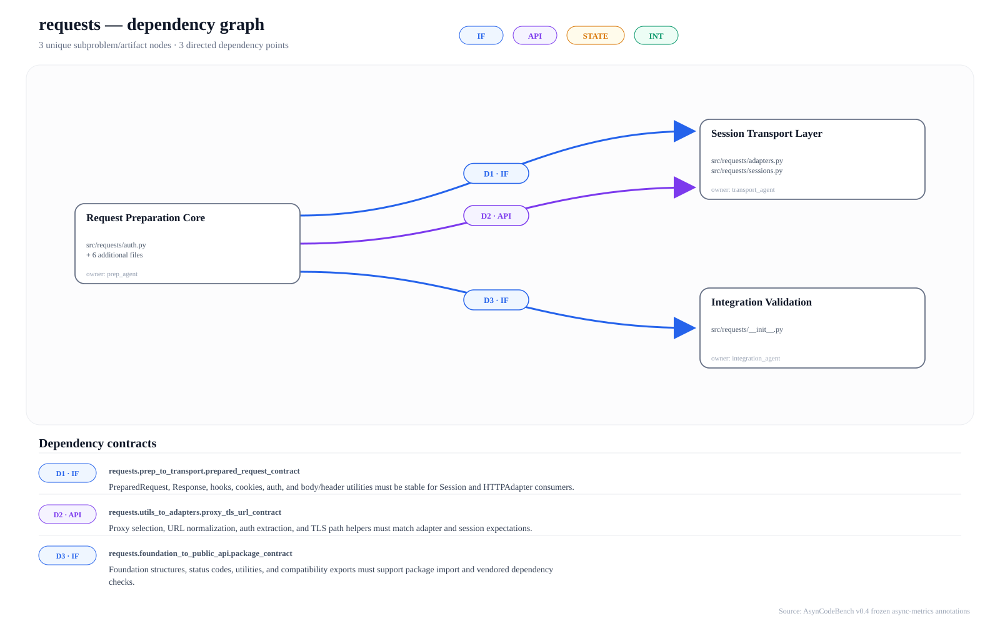

Canonical annotation: [`manifests/pilot/v0.3/metrics/commit0_requests_async_metrics.json`](../../manifests/pilot/v0.3/metrics/commit0_requests_async_metrics.json)

#### D1. requests.prep_to_transport.prepared_request_contract [IF]

- Direction: `request_preparation_core` → `session_transport_layer`
- Ownership: `prep_agent` → `transport_agent`
- Contract: PreparedRequest, Response, hooks, cookies, auth, and body/header utilities must be stable for Session and HTTPAdapter consumers.
- Resolution: Resolved when hook/auth preparation probes and adapter consumer probes pass in the integrated workspace.

<details>
<summary>Exact checker mapping</summary>

**Upstream (3)**

- `tests/test_hooks.py::test_default_hooks`
- `tests/test_hooks.py::test_hooks`
- `tests/test_utils.py::test_get_auth_from_url`

**Downstream (1)**

- `tests/test_adapters.py::test_request_url_trims_leading_path_separators`

**Integrated (3)**

- `tests/test_hooks.py::test_default_hooks`
- `tests/test_utils.py::test_get_auth_from_url`
- `tests/test_adapters.py::test_request_url_trims_leading_path_separators`

</details>

#### D2. requests.utils_to_adapters.proxy_tls_url_contract [API]

- Direction: `request_preparation_core` → `session_transport_layer`
- Ownership: `prep_agent` → `transport_agent`
- Contract: Proxy selection, URL normalization, auth extraction, and TLS path helpers must match adapter and session expectations.
- Resolution: Resolved when URL/proxy utility probes and adapter URL consumer probes pass after integration.

<details>
<summary>Exact checker mapping</summary>

**Upstream (3)**

- `tests/test_utils.py::test_select_proxies`
- `tests/test_utils.py::test_prepend_scheme_if_needed`
- `tests/test_utils.py::test_urldefragauth`

**Downstream (1)**

- `tests/test_adapters.py::test_request_url_trims_leading_path_separators`

**Integrated (3)**

- `tests/test_utils.py::test_select_proxies`
- `tests/test_utils.py::test_prepend_scheme_if_needed`
- `tests/test_adapters.py::test_request_url_trims_leading_path_separators`

</details>

#### D3. requests.foundation_to_public_api.package_contract [IF]

- Direction: `request_preparation_core` → `integration_validation`
- Ownership: `prep_agent` → `integration_agent`
- Contract: Foundation structures, status codes, utilities, and compatibility exports must support package import and vendored dependency checks.
- Resolution: Resolved when foundation utility probes and package compatibility probes pass in the integrated workspace.

<details>
<summary>Exact checker mapping</summary>

**Upstream (2)**

- `tests/test_utils.py::test_to_native_string`
- `tests/test_utils.py::test_unicode_is_ascii`

**Downstream (3)**

- `tests/test_packages.py::test_can_access_urllib3_attribute`
- `tests/test_packages.py::test_can_access_idna_attribute`
- `tests/test_packages.py::test_can_access_chardet_attribute`

**Integrated (3)**

- `tests/test_utils.py::test_to_native_string`
- `tests/test_packages.py::test_can_access_urllib3_attribute`
- `tests/test_packages.py::test_can_access_idna_attribute`

</details>

### 7. simpy

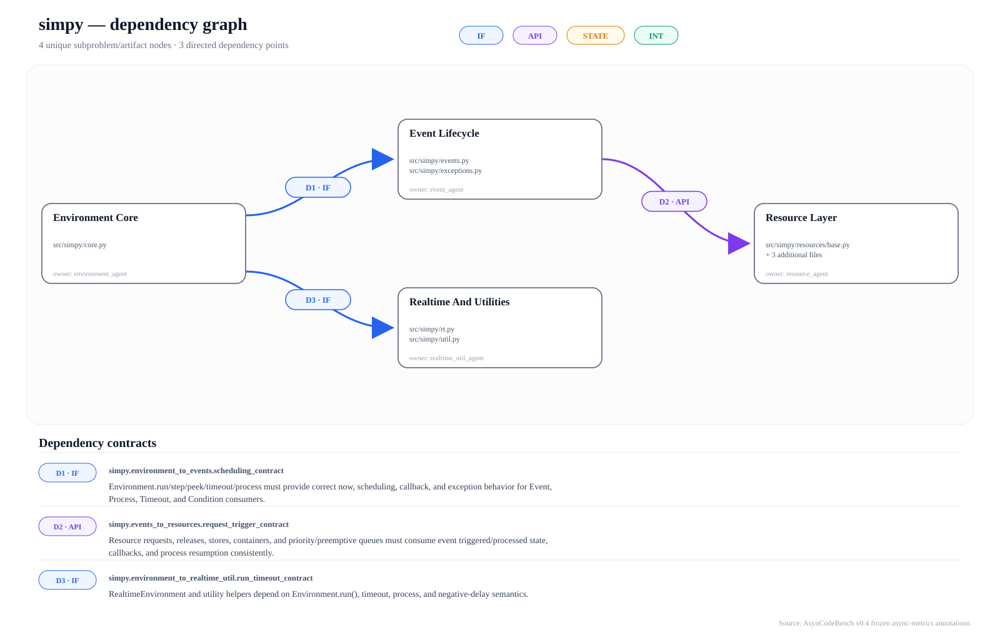

Canonical annotation: [`manifests/pilot/v0.3/metrics/commit0_simpy_async_metrics.json`](../../manifests/pilot/v0.3/metrics/commit0_simpy_async_metrics.json)

#### D1. simpy.environment_to_events.scheduling_contract [IF]

- Direction: `environment_core` → `event_lifecycle`
- Ownership: `environment_agent` → `event_agent`
- Contract: Environment.run/step/peek/timeout/process must provide correct now, scheduling, callback, and exception behavior for Event, Process, Timeout, and Condition consumers.
- Resolution: Resolved when scheduler/time probes and event/process consumer probes pass in the integrated workspace.

<details>
<summary>Exact checker mapping</summary>

**Upstream (2)**

- `tests/test_environment.py::test_run_until_value`
- `tests/test_timeout.py::test_discrete_time_steps`

**Downstream (3)**

- `tests/test_event.py::test_triggered`
- `tests/test_process.py::test_target`
- `tests/test_condition.py::test_all_of_empty_list`

**Integrated (4)**

- `tests/test_environment.py::test_run_until_value`
- `tests/test_timeout.py::test_discrete_time_steps`
- `tests/test_event.py::test_triggered`
- `tests/test_process.py::test_target`

</details>

#### D2. simpy.events_to_resources.request_trigger_contract [API]

- Direction: `event_lifecycle` → `resource_layer`
- Ownership: `event_agent` → `resource_agent`
- Contract: Resource requests, releases, stores, containers, and priority/preemptive queues must consume event triggered/processed state, callbacks, and process resumption consistently.
- Resolution: Resolved when event trigger/callback probes and resource immediate request probes pass after integration.
- Audit flag: Frozen as API. Because the contract explicitly covers triggered/processed state, callbacks, and process resumption across time, STATE may be the cleaner label under the lifecycle rule.

<details>
<summary>Exact checker mapping</summary>

**Upstream (2)**

- `tests/test_event.py::test_triggered`
- `tests/test_event.py::test_condition_callback_removal`

**Downstream (3)**

- `tests/test_resources.py::test_resource`
- `tests/test_resources.py::test_immediate_put_request`
- `tests/test_resources.py::test_immediate_get_request`

**Integrated (4)**

- `tests/test_event.py::test_triggered`
- `tests/test_resources.py::test_resource`
- `tests/test_resources.py::test_immediate_put_request`
- `tests/test_resources.py::test_immediate_get_request`

</details>

#### D3. simpy.environment_to_realtime_util.run_timeout_contract [IF]

- Direction: `environment_core` → `realtime_and_utilities`
- Ownership: `environment_agent` → `realtime_util_agent`
- Contract: RealtimeEnvironment and utility helpers depend on Environment.run(), timeout, process, and negative-delay semantics.
- Resolution: Resolved when environment run/timeout probes and realtime/utility probes pass after integration.

<details>
<summary>Exact checker mapping</summary>

**Upstream (2)**

- `tests/test_environment.py::test_run_until_value`
- `tests/test_timeout.py::test_negative_timeout`

**Downstream (2)**

- `tests/test_rt.py::test_rt[0.1]`
- `tests/test_util.py::test_start_delayed_error`

**Integrated (3)**

- `tests/test_environment.py::test_run_until_value`
- `tests/test_rt.py::test_rt[0.1]`
- `tests/test_util.py::test_start_delayed_error`

</details>

### 8. parsel

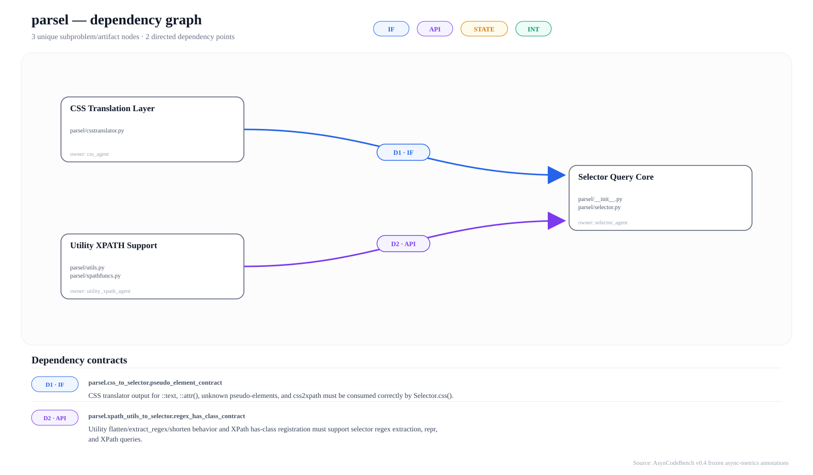

Canonical annotation: [`manifests/pilot/v0.3/metrics/commit0_parsel_async_metrics.json`](../../manifests/pilot/v0.3/metrics/commit0_parsel_async_metrics.json)

#### D1. parsel.css_to_selector.pseudo_element_contract [IF]

- Direction: `css_translation_layer` → `selector_query_core`
- Ownership: `css_agent` → `selector_agent`
- Contract: CSS translator output for ::text, ::attr(), unknown pseudo-elements, and css2xpath must be consumed correctly by Selector.css().
- Resolution: Resolved when translator pseudo-element probes and Selector.css consumer probes pass in the integrated workspace.

<details>
<summary>Exact checker mapping</summary>

**Upstream (5)**

- `tests/test_selector_csstranslator.py::HTMLTranslatorTest::test_text_pseudo_element`
- `tests/test_selector_csstranslator.py::GenericTranslatorTest::test_text_pseudo_element`
- `tests/test_selector_csstranslator.py::HTMLTranslatorTest::test_attr_function`
- `tests/test_selector_csstranslator.py::GenericTranslatorTest::test_attr_function`
- `tests/test_selector_csstranslator.py::UtilCss2XPathTest::test_css2xpath`

**Downstream (2)**

- `tests/test_selector_csstranslator.py::CSSSelectorTest::test_text_pseudo_element`
- `tests/test_selector.py::SelectorTestCase::test_select_on_text_nodes`

**Integrated (4)**

- `tests/test_selector_csstranslator.py::HTMLTranslatorTest::test_text_pseudo_element`
- `tests/test_selector_csstranslator.py::GenericTranslatorTest::test_text_pseudo_element`
- `tests/test_selector_csstranslator.py::CSSSelectorTest::test_text_pseudo_element`
- `tests/test_selector.py::SelectorTestCase::test_select_on_text_nodes`

</details>

#### D2. parsel.xpath_utils_to_selector.regex_has_class_contract [API]

- Direction: `utility_xpath_support` → `selector_query_core`
- Ownership: `utility_xpath_agent` → `selector_agent`
- Contract: Utility flatten/extract_regex/shorten behavior and XPath has-class registration must support selector regex extraction, repr, and XPath queries.
- Resolution: Resolved when utility/XPath probes and selector regex/has-class consumer probes pass after integration.

<details>
<summary>Exact checker mapping</summary>

**Upstream (3)**

- `tests/test_utils.py::test_extract_regex`
- `tests/test_utils.py::test_shorten`
- `tests/test_xpathfuncs.py::XPathFuncsTestCase::test_has_class_simple`

**Downstream (2)**

- `tests/test_selector.py::ExsltTestCase::test_regexp`
- `tests/test_selector_csstranslator.py::CSSSelectorTest::test_pseudoclass_has`

**Integrated (4)**

- `tests/test_utils.py::test_extract_regex`
- `tests/test_xpathfuncs.py::XPathFuncsTestCase::test_has_class_simple`
- `tests/test_selector.py::ExsltTestCase::test_regexp`
- `tests/test_selector_csstranslator.py::CSSSelectorTest::test_pseudoclass_has`

</details>

### 9. filesystem_spec

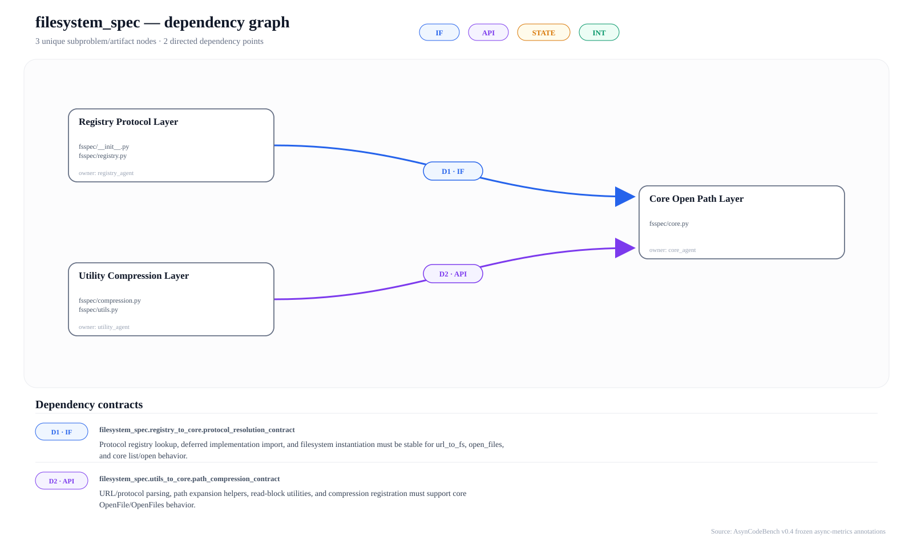

Canonical annotation: [`manifests/pilot/v0.3/metrics/commit0_filesystem_spec_async_metrics.json`](../../manifests/pilot/v0.3/metrics/commit0_filesystem_spec_async_metrics.json)

#### D1. filesystem_spec.registry_to_core.protocol_resolution_contract [IF]

- Direction: `registry_protocol_layer` → `core_open_path_layer`
- Ownership: `registry_agent` → `core_agent`
- Contract: Protocol registry lookup, deferred implementation import, and filesystem instantiation must be stable for url_to_fs, open_files, and core list/open behavior.
- Resolution: Resolved when registry probes and core URL/open consumer probes pass in the integrated workspace.

<details>
<summary>Exact checker mapping</summary>

**Upstream (3)**

- `fsspec/tests/test_registry.py::test_registry_readonly`
- `fsspec/tests/test_registry.py::test_register_cls`
- `fsspec/tests/test_registry.py::test_register_str`

**Downstream (2)**

- `fsspec/tests/test_core.py::test_automkdir_local`
- `fsspec/tests/test_core.py::test_list`

**Integrated (3)**

- `fsspec/tests/test_registry.py::test_registry_readonly`
- `fsspec/tests/test_core.py::test_automkdir_local`
- `fsspec/tests/test_core.py::test_list`

</details>

#### D2. filesystem_spec.utils_to_core.path_compression_contract [API]

- Direction: `utility_compression_layer` → `core_open_path_layer`
- Ownership: `utility_agent` → `core_agent`
- Contract: URL/protocol parsing, path expansion helpers, read-block utilities, and compression registration must support core OpenFile/OpenFiles behavior.
- Resolution: Resolved when utility/compression probes and core path/compression consumer probes pass after integration.

<details>
<summary>Exact checker mapping</summary>

**Upstream (3)**

- `fsspec/tests/test_utils.py::test_get_protocol`
- `fsspec/tests/test_utils.py::test_read_block`
- `fsspec/tests/test_compression.py::test_infer_custom_compression`

**Downstream (2)**

- `fsspec/tests/test_core.py::test_expand_paths`
- `fsspec/tests/test_core.py::test_xz_lzma_compressions`

**Integrated (4)**

- `fsspec/tests/test_utils.py::test_get_protocol`
- `fsspec/tests/test_compression.py::test_infer_custom_compression`
- `fsspec/tests/test_core.py::test_expand_paths`
- `fsspec/tests/test_core.py::test_xz_lzma_compressions`

</details>

#### D3. filesystem_spec.backends_to_core.open_contract [API]

- Direction: `filesystem_backend_layer` → `core_open_path_layer`
- Ownership: `backend_agent` → `core_agent`
- Contract: AbstractFileSystem and the local, memory, and cache backends must provide the open, info, glob, parent, cache mapping, and local-file behavior consumed by core OpenFile/open_local paths.
- Resolution: Resolved when backend open/cache probes and core OpenFile/open_local consumer probes pass together after integration.

<details>
<summary>Exact checker mapping</summary>

**Upstream (3)**

- `fsspec/tests/test_core.py::test_openfile_api`
- `fsspec/tests/test_core.py::test_openfile_open`
- `fsspec/tests/test_core.py::test_open_local_w_cache`

**Downstream (2)**

- `fsspec/tests/test_core.py::test_open_expand`
- `fsspec/tests/test_core.py::test_multi_context`

**Integrated (4)**

- `fsspec/tests/test_core.py::test_openfile_api`
- `fsspec/tests/test_core.py::test_open_local_w_cache`
- `fsspec/tests/test_core.py::test_open_expand`
- `fsspec/tests/test_core.py::test_multi_context`

</details>

### 10. marshmallow

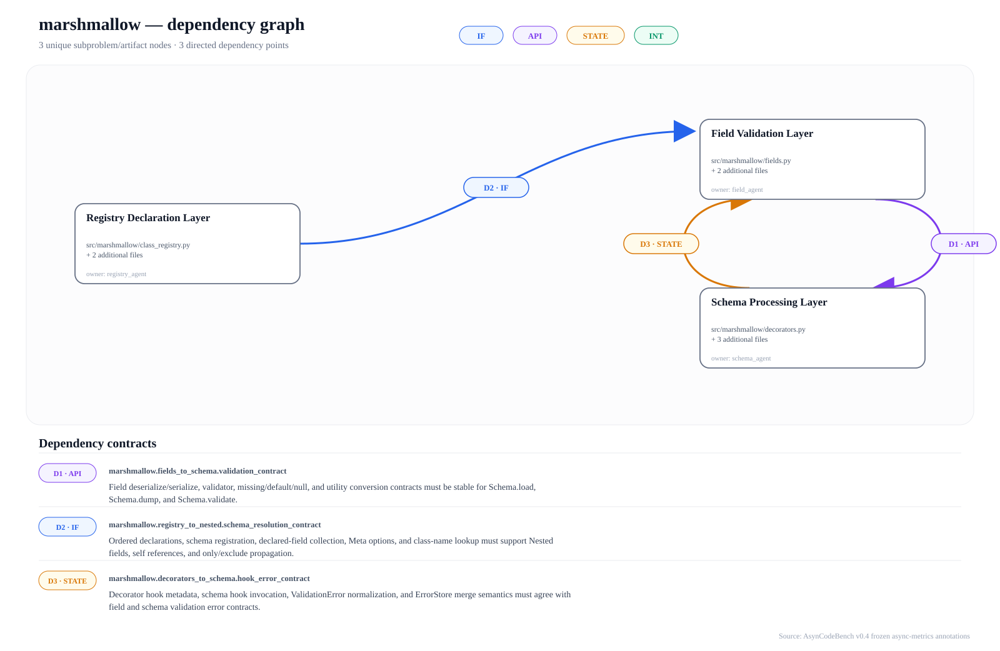

Canonical annotation: [`manifests/pilot/v0.3/metrics/commit0_marshmallow_async_metrics.json`](../../manifests/pilot/v0.3/metrics/commit0_marshmallow_async_metrics.json)

#### D1. marshmallow.fields_to_schema.validation_contract [API]

- Direction: `field_validation_layer` → `schema_processing_layer`
- Ownership: `field_agent` → `schema_agent`
- Contract: Field deserialize/serialize, validator, missing/default/null, and utility conversion contracts must be stable for Schema.load, Schema.dump, and Schema.validate.
- Resolution: Resolved when field/validator probes and schema validation/load probes pass in the integrated workspace.

<details>
<summary>Exact checker mapping</summary>

**Upstream (3)**

- `tests/test_validate.py::test_range_min`
- `tests/test_fields.py::TestErrorMessages::test_make_error`
- `tests/test_deserialization.py::TestFieldDeserialization::test_integer_field_deserialization`

**Downstream (2)**

- `tests/test_schema.py::TestValidate::test_validate_required`
- `tests/test_schema.py::test_load_returns_an_object`

**Integrated (4)**

- `tests/test_validate.py::test_range_min`
- `tests/test_deserialization.py::TestValidation::test_integer_with_validator`
- `tests/test_schema.py::TestValidate::test_validate_required`
- `tests/test_schema.py::test_load_returns_an_object`

</details>

#### D2. marshmallow.registry_to_nested.schema_resolution_contract [IF]

- Direction: `registry_declaration_layer` → `field_validation_layer`
- Ownership: `registry_agent` → `field_agent`
- Contract: Ordered declarations, schema registration, declared-field collection, Meta options, and class-name lookup must support Nested fields, self references, and only/exclude propagation.
- Resolution: Resolved when registry/declaration probes and nested field/schema probes pass after integration.

<details>
<summary>Exact checker mapping</summary>

**Upstream (2)**

- `tests/test_registry.py::test_serializer_has_class_registry`
- `tests/test_options.py::TestFieldOrdering::test_ordering_is_off_by_default`

**Downstream (2)**

- `tests/test_fields.py::TestNestedField::test_nested_schema_only_and_exclude`
- `tests/test_schema.py::TestSelfReference::test_nesting_schema_by_passing_class_name`

**Integrated (4)**

- `tests/test_registry.py::test_serializer_has_class_registry`
- `tests/test_registry.py::test_two_way_nesting`
- `tests/test_fields.py::TestNestedField::test_nested_schema_only_and_exclude`
- `tests/test_schema.py::TestSelfReference::test_nesting_schema_by_passing_class_name`

</details>

#### D3. marshmallow.decorators_to_schema.hook_error_contract [STATE]

- Direction: `schema_processing_layer` → `field_validation_layer`
- Ownership: `schema_agent` → `field_agent`
- Contract: Decorator hook metadata, schema hook invocation, ValidationError normalization, and ErrorStore merge semantics must agree with field and schema validation error contracts.
- Resolution: Resolved when decorator metadata, schema hook processing, ValidationError normalization, field validation, and error-store probes pass together.

<details>
<summary>Exact checker mapping</summary>

**Upstream (3)**

- `tests/test_decorators.py::TestValidatesDecorator::test_validates`
- `tests/test_exceptions.py::TestValidationError::test_stores_dictionaries_in_messages_dict`
- `tests/test_error_store.py::TestMergeErrors::test_merging_dict_and_dict`

**Downstream (2)**

- `tests/test_decorators.py::test_decorator_error_handling`
- `tests/test_decorators.py::TestValidatesSchemaDecorator::test_decorated_validators`

**Integrated (5)**

- `tests/test_decorators.py::TestValidatesDecorator::test_validates`
- `tests/test_decorators.py::TestValidatesSchemaDecorator::test_decorated_validators`
- `tests/test_decorators.py::test_decorator_error_handling`
- `tests/test_exceptions.py::TestValidationError::test_stores_dictionaries_in_messages_dict`
- `tests/test_error_store.py::TestMergeErrors::test_merging_dict_and_dict`

</details>

### 11. graphene

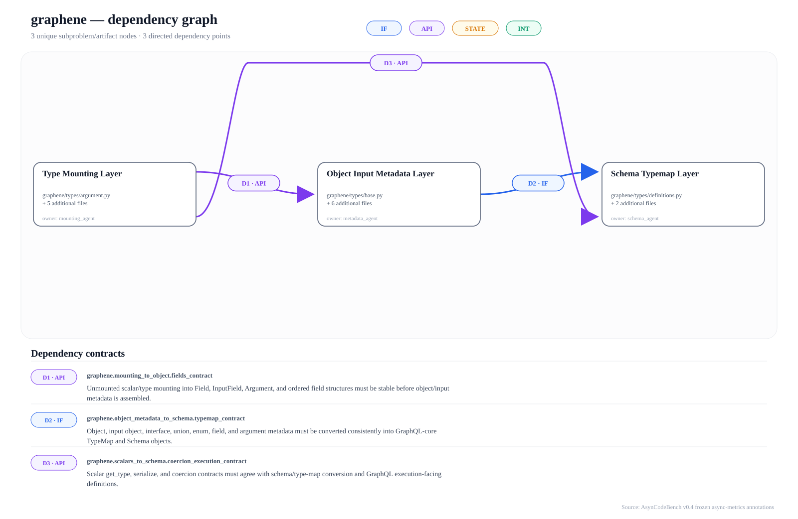

Canonical annotation: [`manifests/pilot/v0.3/metrics/commit0_graphene_async_metrics.json`](../../manifests/pilot/v0.3/metrics/commit0_graphene_async_metrics.json)

#### D1. graphene.mounting_to_object.fields_contract [API]

- Direction: `type_mounting_layer` → `object_input_metadata_layer`
- Ownership: `mounting_agent` → `metadata_agent`
- Contract: Unmounted scalar/type mounting into Field, InputField, Argument, and ordered field structures must be stable before object/input metadata is assembled.
- Resolution: Resolved when mounting/scalar probes and object/input field metadata probes pass in the integrated workspace.

<details>
<summary>Exact checker mapping</summary>

**Upstream (2)**

- `graphene/types/tests/test_scalars_serialization.py::test_serializes_output_int`
- `graphene/types/tests/test_definition.py::test_stringifies_simple_types`

**Downstream (2)**

- `graphene/types/tests/test_objecttype.py::test_generate_objecttype_with_fields`
- `graphene/types/tests/test_inputobjecttype.py::test_generate_inputobjecttype_with_fields`

**Integrated (4)**

- `graphene/types/tests/test_scalars_serialization.py::test_serializes_output_int`
- `graphene/types/tests/test_definition.py::test_stringifies_simple_types`
- `graphene/types/tests/test_objecttype.py::test_generate_objecttype_with_fields`
- `graphene/types/tests/test_inputobjecttype.py::test_generate_inputobjecttype_with_fields`

</details>

#### D2. graphene.object_metadata_to_schema.typemap_contract [IF]

- Direction: `object_input_metadata_layer` → `schema_typemap_layer`
- Ownership: `metadata_agent` → `schema_agent`
- Contract: Object, input object, interface, union, enum, field, and argument metadata must be converted consistently into GraphQL-core TypeMap and Schema objects.
- Resolution: Resolved when object/input metadata probes and schema/TypeMap conversion probes pass together after integration.

<details>
<summary>Exact checker mapping</summary>

**Upstream (2)**

- `graphene/types/tests/test_objecttype.py::test_generate_objecttype_with_meta`
- `graphene/types/tests/test_inputobjecttype.py::test_generate_inputobjecttype_with_meta`

**Downstream (2)**

- `graphene/types/tests/test_schema.py::test_schema`
- `graphene/types/tests/test_definition.py::test_defines_a_query_only_schema`

**Integrated (5)**

- `graphene/types/tests/test_objecttype.py::test_generate_objecttype_with_meta`
- `graphene/types/tests/test_inputobjecttype.py::test_generate_inputobjecttype_with_meta`
- `graphene/types/tests/test_definition.py::test_includes_nested_input_objects_in_the_map`
- `graphene/types/tests/test_definition.py::test_includes_types_in_union`
- `graphene/types/tests/test_schema.py::test_schema_introspect`

</details>

#### D3. graphene.scalars_to_schema.coercion_execution_contract [API]

- Direction: `type_mounting_layer` → `schema_typemap_layer`
- Ownership: `mounting_agent` → `schema_agent`
- Contract: Scalar get_type, serialize, and coercion contracts must agree with schema/type-map conversion and GraphQL execution-facing definitions.
- Resolution: Resolved when scalar serialization probes and schema get_type/query definition probes pass in the integrated workspace.

<details>
<summary>Exact checker mapping</summary>

**Upstream (3)**

- `graphene/types/tests/test_scalars_serialization.py::test_serializes_output_int`
- `graphene/types/tests/test_scalars_serialization.py::test_serializes_output_float`
- `graphene/types/tests/test_scalars_serialization.py::test_serializes_output_string`

**Downstream (2)**

- `graphene/types/tests/test_schema.py::test_schema_get_type`
- `graphene/types/tests/test_definition.py::test_defines_a_query_only_schema`

**Integrated (5)**

- `graphene/types/tests/test_scalars_serialization.py::test_serializes_output_int`
- `graphene/types/tests/test_scalars_serialization.py::test_serializes_output_float`
- `graphene/types/tests/test_scalars_serialization.py::test_serializes_output_string`
- `graphene/types/tests/test_schema.py::test_schema_get_type`
- `graphene/types/tests/test_definition.py::test_defines_a_query_only_schema`

</details>

### 12. imapclient

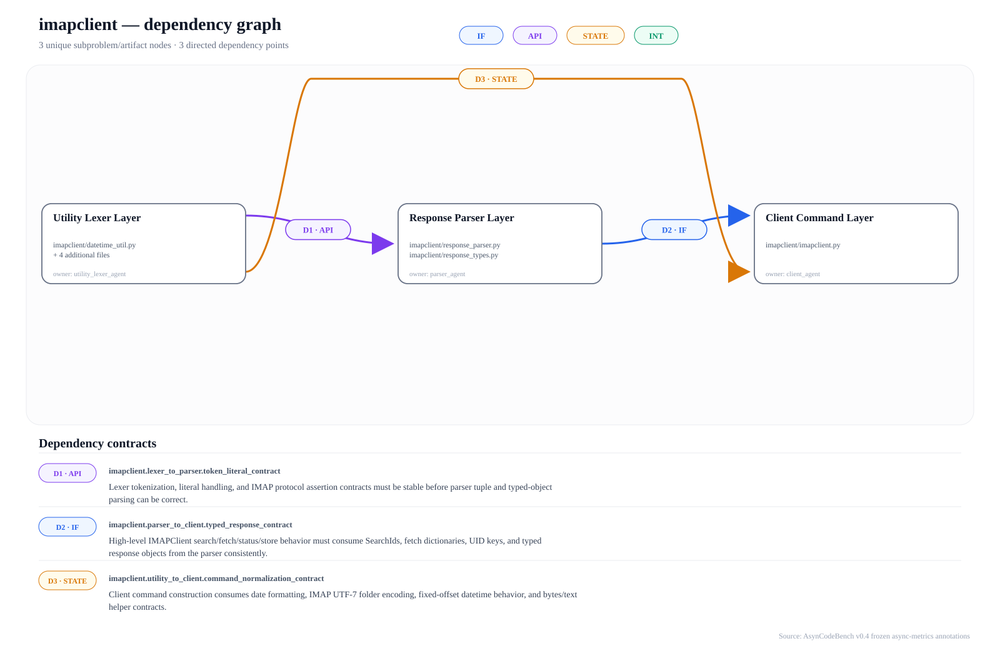

Canonical annotation: [`manifests/pilot/v0.3/metrics/commit0_imapclient_async_metrics.json`](../../manifests/pilot/v0.3/metrics/commit0_imapclient_async_metrics.json)

#### D1. imapclient.lexer_to_parser.token_literal_contract [API]

- Direction: `utility_lexer_layer` → `response_parser_layer`
- Ownership: `utility_lexer_agent` → `parser_agent`
- Contract: Lexer tokenization, literal handling, and IMAP protocol assertion contracts must be stable before parser tuple and typed-object parsing can be correct.
- Resolution: Resolved when lexer literal/string probes and parser literal/tuple probes pass in the integrated workspace.
- Audit flag: Frozen as API. The parser directly consumes lexer tokens and literal semantics; if no second layer must reproduce the same public behavior, this is more naturally IF.

<details>
<summary>Exact checker mapping</summary>

**Upstream (2)**

- `tests/test_response_lexer.py::TestTokenSource::test_literal`
- `tests/test_response_lexer.py::TestTokenSource::test_quoted_strings`

**Downstream (2)**

- `tests/test_response_parser.py::TestParseResponse::test_literal`
- `tests/test_response_parser.py::TestParseResponse::test_tuple`

**Integrated (4)**

- `tests/test_response_lexer.py::TestTokenSource::test_literal`
- `tests/test_response_lexer.py::TestTokenSource::test_quoted_strings`
- `tests/test_response_parser.py::TestParseResponse::test_literal`
- `tests/test_response_parser.py::TestParseResponse::test_tuple`

</details>

#### D2. imapclient.parser_to_client.typed_response_contract [IF]

- Direction: `response_parser_layer` → `client_command_layer`
- Ownership: `parser_agent` → `client_agent`
- Contract: High-level IMAPClient search/fetch/status/store behavior must consume SearchIds, fetch dictionaries, UID keys, and typed response objects from the parser consistently.
- Resolution: Resolved when parser typed response probes and client search/fetch consumer probes pass together after integration.

<details>
<summary>Exact checker mapping</summary>

**Upstream (2)**

- `tests/test_response_parser.py::TestParseMessageList::test_modseq`
- `tests/test_response_parser.py::TestParseFetchResponse::test_UID`

**Downstream (2)**

- `tests/test_search.py::TestSearch::test_modseq`
- `tests/test_imapclient.py::TestTimeNormalisation::test_pass_through`

**Integrated (4)**

- `tests/test_response_parser.py::TestParseMessageList::test_modseq`
- `tests/test_response_parser.py::TestParseFetchResponse::test_UID`
- `tests/test_search.py::TestSearch::test_modseq`
- `tests/test_imapclient.py::TestTimeNormalisation::test_pass_through`

</details>

#### D3. imapclient.utility_to_client.command_normalization_contract [STATE]

- Direction: `utility_lexer_layer` → `client_command_layer`
- Ownership: `utility_lexer_agent` → `client_agent`
- Contract: Client command construction consumes date formatting, IMAP UTF-7 folder encoding, fixed-offset datetime behavior, and bytes/text helper contracts.
- Resolution: Resolved when utility/date/UTF-7 probes and client command/folder probes pass after integration.
- Audit flag: Frozen as STATE. The registered probes exercise one-shot date/UTF-7 normalization, not a read-write-invalidate-reread lifecycle; IF is more natural unless additional persistent-state evidence is documented.

<details>
<summary>Exact checker mapping</summary>

**Upstream (2)**

- `tests/test_datetime_util.py::TestCriteriaDateFormatting::test_basic`
- `tests/test_imap_utf7.py::IMAP4UTF7TestCase::test_encode`

**Downstream (2)**

- `tests/test_search.py::TestSearch::test_with_date`
- `tests/test_imapclient.py::TestListFolders::test_utf7_decoding`

**Integrated (4)**

- `tests/test_datetime_util.py::TestCriteriaDateFormatting::test_basic`
- `tests/test_imap_utf7.py::IMAP4UTF7TestCase::test_encode`
- `tests/test_search.py::TestSearch::test_with_date`
- `tests/test_imapclient.py::TestListFolders::test_utf7_decoding`

</details>

### 13. pexpect

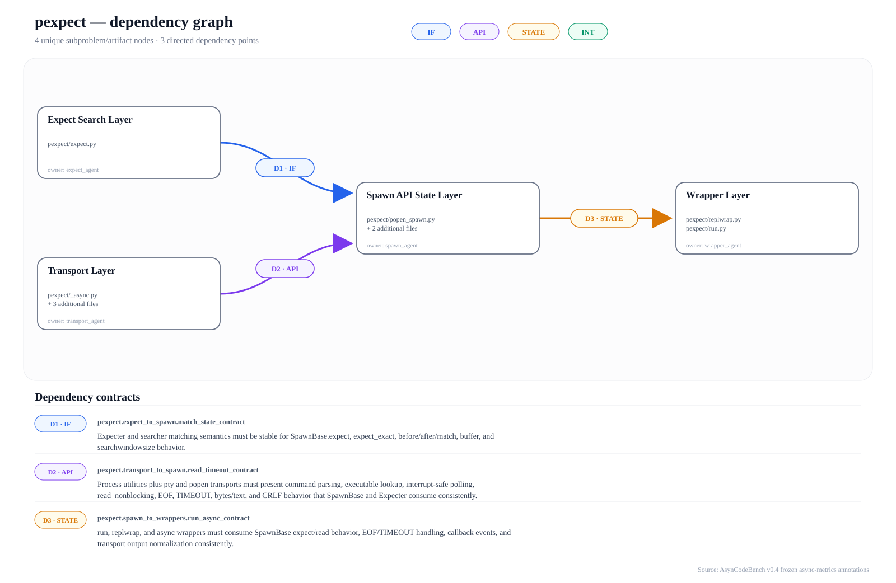

Canonical annotation: [`manifests/pilot/v0.3/metrics/commit0_pexpect_async_metrics.json`](../../manifests/pilot/v0.3/metrics/commit0_pexpect_async_metrics.json)

#### D1. pexpect.expect_to_spawn.match_state_contract [IF]

- Direction: `expect_search_layer` → `spawn_api_state_layer`
- Ownership: `expect_agent` → `spawn_agent`
- Contract: Expecter and searcher matching semantics must be stable for SpawnBase.expect, expect_exact, before/after/match, buffer, and searchwindowsize behavior.
- Resolution: Resolved when expect/search ordering, buffer state, and search window probes pass in the integrated workspace.

<details>
<summary>Exact checker mapping</summary>

**Upstream (2)**

- `tests/test_expect.py::ExpectTestCase::test_expect_order`
- `tests/test_expect.py::ExpectTestCase::test_ordering`

**Downstream (2)**

- `tests/test_expect.py::ExpectTestCase::test_before_after`
- `tests/test_expect.py::ExpectTestCase::test_searchwindowsize`

**Integrated (3)**

- `tests/test_expect.py::ExpectTestCase::test_expect_order`
- `tests/test_expect.py::ExpectTestCase::test_before_after`
- `tests/test_expect.py::ExpectTestCase::test_searchwindowsize`

</details>

#### D2. pexpect.transport_to_spawn.read_timeout_contract [API]

- Direction: `transport_layer` → `spawn_api_state_layer`
- Ownership: `transport_agent` → `spawn_agent`
- Contract: Process utilities plus pty and popen transports must present command parsing, executable lookup, interrupt-safe polling, read_nonblocking, EOF, TIMEOUT, bytes/text, and CRLF behavior that SpawnBase and Expecter consume consistently.
- Resolution: Resolved when transport probes and SpawnBase EOF/TIMEOUT consumer probes pass together after integration.

<details>
<summary>Exact checker mapping</summary>

**Upstream (2)**

- `tests/test_popen_spawn.py::ExpectTestCase::test_expect`
- `tests/test_popen_spawn.py::ExpectTestCase::test_crlf`

**Downstream (2)**

- `tests/test_expect.py::ExpectTestCase::test_expect_timeout`
- `tests/test_expect.py::ExpectTestCase::test_unexpected_eof`

**Integrated (4)**

- `tests/test_popen_spawn.py::ExpectTestCase::test_expect`
- `tests/test_popen_spawn.py::ExpectTestCase::test_crlf`
- `tests/test_expect.py::ExpectTestCase::test_expect_timeout`
- `tests/test_expect.py::ExpectTestCase::test_unexpected_eof`

</details>

#### D3. pexpect.spawn_to_wrappers.run_async_contract [STATE]

- Direction: `spawn_api_state_layer` → `wrapper_layer`
- Ownership: `spawn_agent` → `wrapper_agent`
- Contract: run, replwrap, and async wrappers must consume SpawnBase expect/read behavior, EOF/TIMEOUT handling, callback events, and transport output normalization consistently.
- Resolution: Resolved when SpawnBase/transport expect probes and run/replwrap/async wrapper probes pass in the final integrated workspace.

<details>
<summary>Exact checker mapping</summary>

**Upstream (2)**

- `tests/test_expect.py::ExpectTestCase::test_expect`
- `tests/test_popen_spawn.py::ExpectTestCase::test_expect`

**Downstream (2)**

- `tests/test_run.py::RunFuncTestCase::test_run`
- `tests/test_async.py::AsyncTests::test_async_replwrap`

**Integrated (4)**

- `tests/test_expect.py::ExpectTestCase::test_expect`
- `tests/test_popen_spawn.py::ExpectTestCase::test_expect`
- `tests/test_run.py::RunFuncTestCase::test_run`
- `tests/test_async.py::AsyncTests::test_async_replwrap`

</details>

### 14. flask

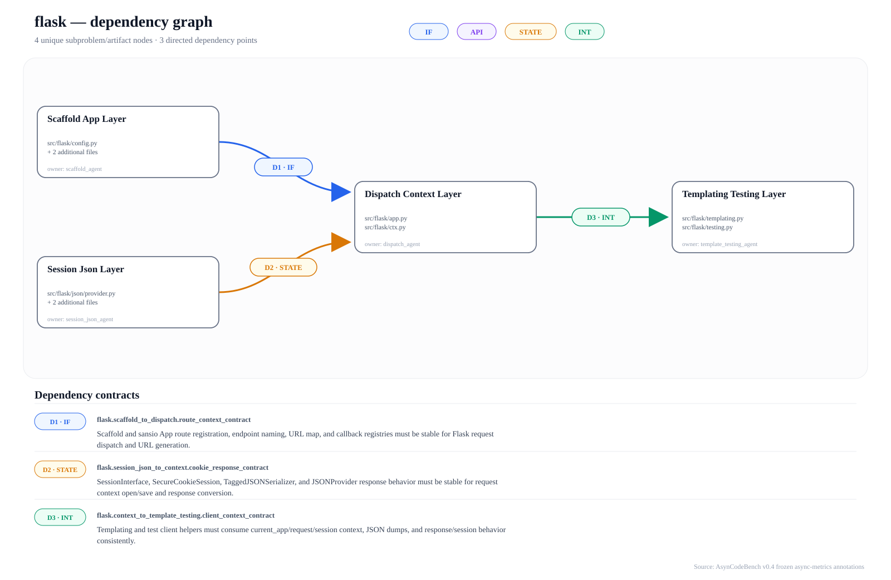

Canonical annotation: [`manifests/pilot/v0.3/metrics/commit0_flask_async_metrics.json`](../../manifests/pilot/v0.3/metrics/commit0_flask_async_metrics.json)

#### D1. flask.scaffold_to_dispatch.route_context_contract [IF]

- Direction: `scaffold_app_layer` → `dispatch_context_layer`
- Ownership: `scaffold_agent` → `dispatch_agent`
- Contract: Scaffold and sansio App route registration, endpoint naming, URL map, and callback registries must be stable for Flask request dispatch and URL generation.
- Resolution: Resolved when route registration, request dispatch, and URL map probes pass together in the integrated workspace.

<details>
<summary>Exact checker mapping</summary>

**Upstream (2)**

- `tests/test_basic.py::test_route_decorator_custom_endpoint`
- `tests/test_basic.py::test_url_mapping`

**Downstream (2)**

- `tests/test_basic.py::test_request_dispatching`
- `tests/test_basic.py::test_url_generation`

**Integrated (3)**

- `tests/test_basic.py::test_route_decorator_custom_endpoint`
- `tests/test_basic.py::test_request_dispatching`
- `tests/test_basic.py::test_url_mapping`

</details>

#### D2. flask.session_json_to_context.cookie_response_contract [STATE]

- Direction: `session_json_layer` → `dispatch_context_layer`
- Ownership: `session_json_agent` → `dispatch_agent`
- Contract: SessionInterface, SecureCookieSession, TaggedJSONSerializer, and JSONProvider response behavior must be stable for request context open/save and response conversion.
- Resolution: Resolved when JSON provider, session cookie, and request-context session probes pass after integration.

<details>
<summary>Exact checker mapping</summary>

**Upstream (2)**

- `tests/test_json.py::test_jsonify_basic_types`
- `tests/test_json.py::test_jsonify_datetime`

**Downstream (2)**

- `tests/test_basic.py::test_session`
- `tests/test_reqctx.py::test_session_dynamic_cookie_name`

**Integrated (3)**

- `tests/test_json.py::test_jsonify_basic_types`
- `tests/test_basic.py::test_session`
- `tests/test_session_interface.py::test_open_session_with_endpoint`

</details>

#### D3. flask.context_to_template_testing.client_context_contract [INT]

- Direction: `dispatch_context_layer` → `templating_testing_layer`
- Ownership: `dispatch_agent` → `template_testing_agent`
- Contract: Templating and test client helpers must consume current_app/request/session context, JSON dumps, and response/session behavior consistently.
- Resolution: Resolved when app/request context probes, templating context probes, and test-client session probes pass after integration.

<details>
<summary>Exact checker mapping</summary>

**Upstream (2)**

- `tests/test_reqctx.py::test_context_binding`
- `tests/test_appctx.py::test_request_context_means_app_context`

**Downstream (2)**

- `tests/test_templating.py::test_context_processing`
- `tests/test_testing.py::test_json_request_and_response`

**Integrated (3)**

- `tests/test_appctx.py::test_request_context_means_app_context`
- `tests/test_templating.py::test_context_processing`
- `tests/test_testing.py::test_session_transactions`

</details>

### 15. python-rsa

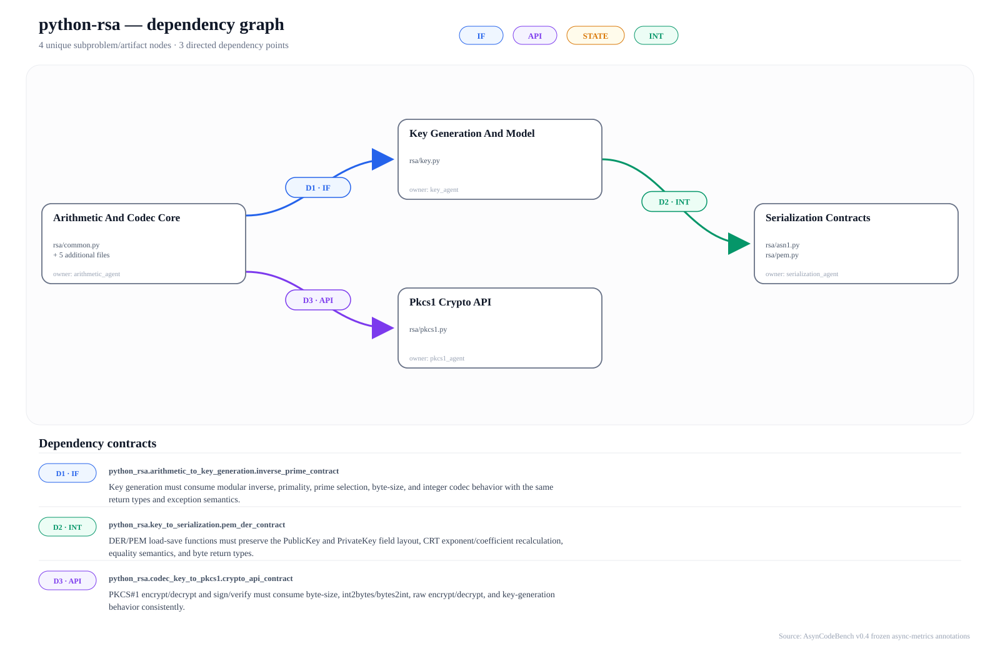

Canonical annotation: [`manifests/pilot/v0.3/metrics/commit0_python_rsa_async_metrics.json`](../../manifests/pilot/v0.3/metrics/commit0_python_rsa_async_metrics.json)

#### D1. python_rsa.arithmetic_to_key_generation.inverse_prime_contract [IF]

- Direction: `arithmetic_and_codec_core` → `key_generation_and_model`
- Ownership: `arithmetic_agent` → `key_agent`
- Contract: Key generation must consume modular inverse, primality, prime selection, byte-size, and integer codec behavior with the same return types and exception semantics.
- Resolution: Resolved when arithmetic probes and key-generation consumer probes pass in the integrated workspace.

<details>
<summary>Exact checker mapping</summary>

**Upstream (3)**

- `tests/test_common.py::TestInverse::test_normal`
- `tests/test_prime.py::PrimeTest::test_is_prime`
- `tests/test_transform.py::Test_int2bytes::test_codec_identity`

**Downstream (3)**

- `tests/test_key.py::KeyGenTest::test_default_exponent`
- `tests/test_key.py::KeyGenTest::test_custom_exponent`
- `tests/test_key.py::KeyGenTest::test_exponents_coefficient_calculation`

**Integrated (4)**

- `tests/test_common.py::TestInverse::test_normal`
- `tests/test_prime.py::PrimeTest::test_is_prime`
- `tests/test_key.py::KeyGenTest::test_default_exponent`
- `tests/test_key.py::KeyGenTest::test_custom_exponent`

</details>

#### D2. python_rsa.key_to_serialization.pem_der_contract [INT]

- Direction: `key_generation_and_model` → `serialization_contracts`
- Ownership: `key_agent` → `serialization_agent`
- Contract: DER/PEM load-save functions must preserve the PublicKey and PrivateKey field layout, CRT exponent/coefficient recalculation, equality semantics, and byte return types.
- Resolution: Resolved when key-field probes and public DER/PEM load-save probes pass after integration.

<details>
<summary>Exact checker mapping</summary>

**Upstream (2)**

- `tests/test_key.py::KeyGenTest::test_exponents_coefficient_calculation`
- `tests/test_key.py::HashTest::test_hash_possible`

**Downstream (3)**

- `tests/test_load_save_keys.py::PemTest::test_load_private_key`
- `tests/test_load_save_keys.py::DerTest::test_load_public_key`
- `tests/test_pem.py::TestMarkers::test_values`

**Integrated (4)**

- `tests/test_key.py::KeyGenTest::test_exponents_coefficient_calculation`
- `tests/test_load_save_keys.py::PemTest::test_load_private_key`
- `tests/test_load_save_keys.py::DerTest::test_load_public_key`
- `tests/test_pem.py::TestMarkers::test_values`

</details>

#### D3. python_rsa.codec_key_to_pkcs1.crypto_api_contract [API]

- Direction: `arithmetic_and_codec_core` → `pkcs1_crypto_api`
- Ownership: `arithmetic_agent` → `pkcs1_agent`
- Contract: PKCS#1 encrypt/decrypt and sign/verify must consume byte-size, int2bytes/bytes2int, raw encrypt/decrypt, and key-generation behavior consistently.
- Resolution: Resolved when codec/key probes and PKCS#1 encryption/signature probes pass in the integrated workspace.

<details>
<summary>Exact checker mapping</summary>

**Upstream (3)**

- `tests/test_common.py::TestByteSize::test_values`
- `tests/test_transform.py::Test_int2bytes::test_accuracy`
- `tests/test_key.py::KeyGenTest::test_default_exponent`

**Downstream (3)**

- `tests/test_pkcs1.py::BinaryTest::test_enc_dec`
- `tests/test_pkcs1.py::SignatureTest::test_sign_verify`
- `tests/test_strings.py::StringTest::test_enc_dec`

**Integrated (5)**

- `tests/test_common.py::TestByteSize::test_values`
- `tests/test_transform.py::Test_int2bytes::test_accuracy`
- `tests/test_key.py::KeyGenTest::test_default_exponent`
- `tests/test_pkcs1.py::BinaryTest::test_enc_dec`
- `tests/test_pkcs1.py::SignatureTest::test_sign_verify`

</details>

### 16. cookiecutter

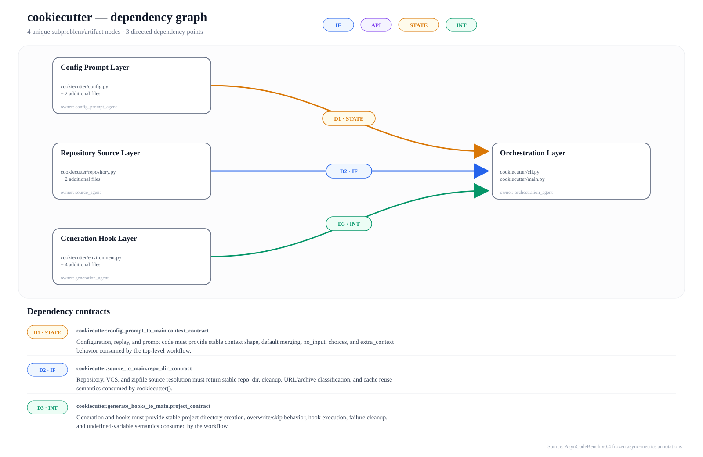

Canonical annotation: [`manifests/pilot/v0.3/metrics/commit0_cookiecutter_async_metrics.json`](../../manifests/pilot/v0.3/metrics/commit0_cookiecutter_async_metrics.json)

#### D1. cookiecutter.config_prompt_to_main.context_contract [STATE]

- Direction: `config_prompt_layer` → `orchestration_layer`
- Ownership: `config_prompt_agent` → `orchestration_agent`
- Contract: Configuration, replay, and prompt code must provide stable context shape, default merging, no_input, choices, and extra_context behavior consumed by the top-level workflow.
- Resolution: Resolved when config/context/prompt probes and main workflow context preservation probes pass in the integrated workspace.

<details>
<summary>Exact checker mapping</summary>

**Upstream (3)**

- `tests/test_get_config.py::test_get_config`
- `tests/test_generate_context.py::test_generate_context`
- `tests/test_prompt.py::TestRenderVariable::test_convert_to_str`

**Downstream (2)**

- `tests/test_main.py::test_original_cookiecutter_options_preserved_in__cookiecutter`
- `tests/test_main.py::test_replay_load_template_name`

**Integrated (4)**

- `tests/test_get_config.py::test_get_config`
- `tests/test_generate_context.py::test_generate_context`
- `tests/test_prompt.py::TestRenderVariable::test_convert_to_str`
- `tests/test_main.py::test_original_cookiecutter_options_preserved_in__cookiecutter`

</details>

#### D2. cookiecutter.source_to_main.repo_dir_contract [IF]

- Direction: `repository_source_layer` → `orchestration_layer`
- Ownership: `source_agent` → `orchestration_agent`
- Contract: Repository, VCS, and zipfile source resolution must return stable repo_dir, cleanup, URL/archive classification, and cache reuse semantics consumed by cookiecutter().
- Resolution: Resolved when source resolution probes and top-level workflow probes pass after integration.

<details>
<summary>Exact checker mapping</summary>

**Upstream (4)**

- `tests/repository/test_is_repo_url.py::test_is_repo_url_for_remote_urls`
- `tests/repository/test_repository_has_cookiecutter_json.py::test_valid_repository`
- `tests/vcs/test_identify_repo.py::test_identify_known_repo`
- `tests/zipfile/test_unzip.py::test_unzip_local_file`

**Downstream (2)**

- `tests/test_main.py::test_replay_dump_template_name`
- `tests/test_main.py::test_custom_replay_file`

**Integrated (5)**

- `tests/repository/test_is_repo_url.py::test_is_repo_url_for_remote_urls`
- `tests/repository/test_determine_repository_should_use_local_repo.py::test_finds_local_repo`
- `tests/vcs/test_identify_repo.py::test_identify_known_repo`
- `tests/zipfile/test_unzip.py::test_unzip_local_file`
- `tests/test_main.py::test_custom_replay_file`

</details>

#### D3. cookiecutter.generate_hooks_to_main.project_contract [INT]

- Direction: `generation_hook_layer` → `orchestration_layer`
- Ownership: `generation_agent` → `orchestration_agent`
- Contract: Generation and hooks must provide stable project directory creation, overwrite/skip behavior, hook execution, failure cleanup, and undefined-variable semantics consumed by the workflow.
- Resolution: Resolved when template discovery, file generation, hook execution, and main workflow probes pass together.

<details>
<summary>Exact checker mapping</summary>

**Upstream (4)**

- `tests/test_find.py::test_find_template`
- `tests/test_generate_files.py::test_generate_files`
- `tests/test_generate_hooks.py::test_run_python_hooks`
- `tests/test_hooks.py::TestExternalHooks::test_run_hook`

**Downstream (2)**

- `tests/test_main.py::test_original_cookiecutter_options_preserved_in__cookiecutter`
- `tests/test_main.py::test_replay_dump_template_name`

**Integrated (5)**

- `tests/test_find.py::test_find_template`
- `tests/test_generate_files.py::test_generate_files`
- `tests/test_generate_hooks.py::test_run_python_hooks`
- `tests/test_hooks.py::TestExternalHooks::test_run_hook`
- `tests/test_main.py::test_original_cookiecutter_options_preserved_in__cookiecutter`

</details>

### 17. apache-tvm-20018

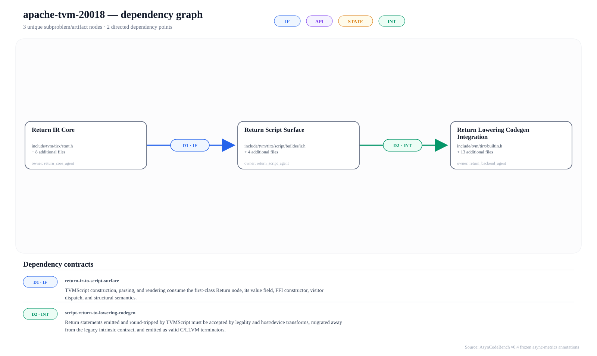

Canonical annotation: [`manifests/candidates/pr_hard_v0.4/metrics/apache_tvm_20018_async_metrics.json`](../../manifests/candidates/pr_hard_v0.4/metrics/apache_tvm_20018_async_metrics.json)

#### D1. return-ir-to-script-surface [IF]

- Direction: `return_ir_core` → `return_script_surface`
- Ownership: `return_core_agent` → `return_script_agent`
- Contract: TVMScript construction, parsing, and rendering consume the first-class Return node, its value field, FFI constructor, visitor dispatch, and structural semantics.
- Resolution: Not separately recorded.

<details>
<summary>Exact checker mapping</summary>

**Upstream (3)**

- `tests/python/tirx-base/test_tir_base.py::test_return_accepts_expr_and_roundtrips`
- `tests/python/tirx-base/test_tir_base.py::test_return_stmt_functor_traversal_and_mutation`
- `tests/python/tirx/transform/test_stmt_functor.py::test_return`

**Downstream (2)**

- `tests/python/tvmscript/test_tvmscript_syntax_sugar.py::test_return_statement`
- `tests/python/tvmscript/test_tvmscript_printer_tir.py::test_return_statement`

**Integrated (2)**

- `tests/python/tvmscript/test_tvmscript_syntax_sugar.py::test_return_statement`
- `tests/python/tvmscript/test_tvmscript_printer_tir.py::test_return_statement`

</details>

#### D2. script-return-to-lowering-codegen [INT]

- Direction: `return_script_surface` → `return_lowering_codegen_integration`
- Ownership: `return_script_agent` → `return_backend_agent`
- Contract: Return statements emitted and round-tripped by TVMScript must be accepted by legality and host/device transforms, migrated away from the legacy intrinsic contract, and emitted as valid C/LLVM terminators.
- Resolution: Not separately recorded.

<details>
<summary>Exact checker mapping</summary>

**Upstream (2)**

- `tests/python/tvmscript/test_tvmscript_syntax_sugar.py::test_return_statement`
- `tests/python/tvmscript/test_tvmscript_printer_tir.py::test_return_statement`

**Downstream (3)**

- `tests/python/tirx-transform/test_tir_transform_make_packed_api.py::test_return_from_parallel_scope_is_rejected`
- `tests/python/tirx-transform/test_tir_transform_split_host_device.py::test_device_kernel_nonzero_return_is_rejected`
- `tests/python/tirx-base/test_tir_base.py::test_return_const`

**Integrated (3)**

- `tests/python/tirx-transform/test_tir_transform_make_packed_api.py::test_return_from_parallel_scope_is_rejected`
- `tests/python/tirx-transform/test_tir_transform_split_host_device.py::test_device_kernel_nonzero_return_is_rejected`
- `tests/python/tirx-base/test_tir_base.py::test_return_const`

</details>

### 18. apache-tvm-20073

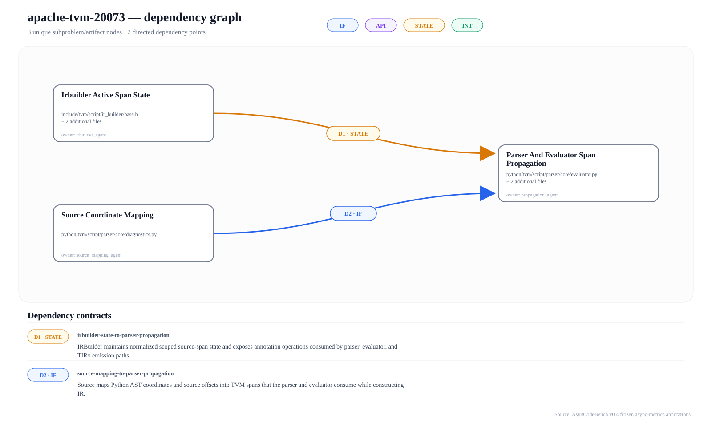

Canonical annotation: [`manifests/candidates/pr_hard_v0.4/metrics/apache_tvm_20073_async_metrics.json`](../../manifests/candidates/pr_hard_v0.4/metrics/apache_tvm_20073_async_metrics.json)

#### D1. irbuilder-state-to-parser-propagation [STATE]

- Direction: `irbuilder_active_span_state` → `parser_and_evaluator_span_propagation`
- Ownership: `irbuilder_agent` → `propagation_agent`
- Contract: IRBuilder maintains normalized scoped source-span state and exposes annotation operations consumed by parser, evaluator, and TIRx emission paths.
- Resolution: Not separately recorded.

<details>
<summary>Exact checker mapping</summary>

**Upstream (1)**

- `tests/python/tvmscript/test_tvmscript_ir_builder_tir.py::test_ir_builder_source_span_applies_to_emitted_stmt`

**Downstream (3)**

- `tests/python/tvmscript/test_tvmscript_parser_source.py::test_parser_attaches_span_to_direct_call`
- `tests/python/tvmscript/test_tvmscript_parser_source.py::test_parser_retains_inline_call_site_and_definition_spans`
- `tests/python/tvmscript/test_tvmscript_parser_source.py::test_parser_attaches_span_to_tile_primitive_call`

**Integrated (4)**

- `tests/python/tvmscript/test_tvmscript_parser_source.py::test_parser_attaches_span_to_direct_call`
- `tests/python/tvmscript/test_tvmscript_parser_source.py::test_parser_retains_inline_call_site_and_definition_spans`
- `tests/python/tvmscript/test_tvmscript_parser_source.py::test_parser_attaches_span_to_tile_primitive_call`
- `tests/python/tvmscript/test_tvmscript_parser_source.py::test_parser_spans_do_not_affect_structural_identity`

</details>

#### D2. source-mapping-to-parser-propagation [IF]

- Direction: `source_coordinate_mapping` → `parser_and_evaluator_span_propagation`
- Ownership: `source_mapping_agent` → `propagation_agent`
- Contract: Source maps Python AST coordinates and source offsets into TVM spans that the parser and evaluator consume while constructing IR.
- Resolution: Not separately recorded.

<details>
<summary>Exact checker mapping</summary>

**Upstream (1)**

- `tests/python/tvmscript/test_tvmscript_parser_source.py::test_source_to_span_matches_parser_diagnostic_coordinates`

**Downstream (2)**

- `tests/python/tvmscript/test_tvmscript_parser_source.py::test_parser_attaches_span_to_direct_call`
- `tests/python/tvmscript/test_tvmscript_parser_source.py::test_parser_attaches_span_to_tile_primitive_call`

**Integrated (4)**

- `tests/python/tvmscript/test_tvmscript_parser_source.py::test_parser_attaches_span_to_direct_call`
- `tests/python/tvmscript/test_tvmscript_parser_source.py::test_parser_retains_inline_call_site_and_definition_spans`
- `tests/python/tvmscript/test_tvmscript_parser_source.py::test_parser_attaches_span_to_tile_primitive_call`
- `tests/python/tvmscript/test_tvmscript_parser_source.py::test_parser_spans_do_not_affect_structural_identity`

</details>

### 19. apache-tvm-20107

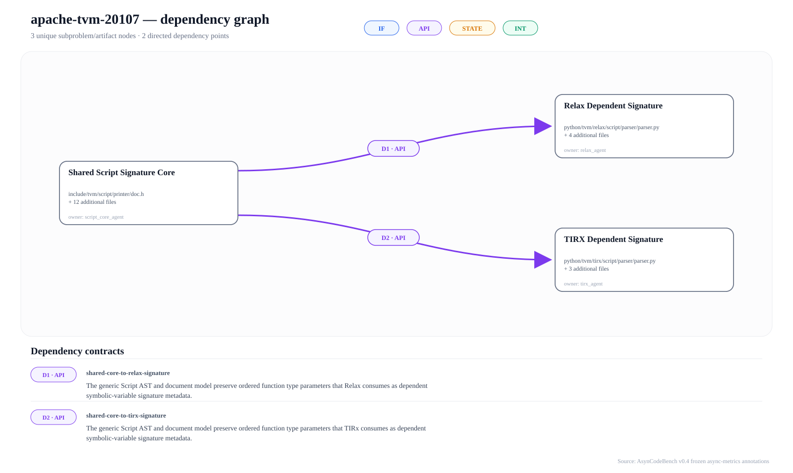

Canonical annotation: [`manifests/candidates/pr_hard_v0.4/metrics/apache_tvm_20107_async_metrics.json`](../../manifests/candidates/pr_hard_v0.4/metrics/apache_tvm_20107_async_metrics.json)

#### D1. shared-core-to-relax-signature [API]

- Direction: `shared_script_signature_core` → `relax_dependent_signature`
- Ownership: `script_core_agent` → `relax_agent`
- Contract: The generic Script AST and document model preserve ordered function type parameters that Relax consumes as dependent symbolic-variable signature metadata.
- Resolution: Not separately recorded.

<details>
<summary>Exact checker mapping</summary>

**Upstream (1)**

- `tests/python/tvmscript/test_tvmscript_printer_python_doc_printer.py::test_print_function_doc_with_type_params`

**Downstream (1)**

- `tests/python/relax/test_tvmscript_type_vars.py::test_type_vars_roundtrip`

**Integrated (1)**

- `tests/python/relax/test_tvmscript_type_vars.py::test_type_vars_roundtrip`

</details>

#### D2. shared-core-to-tirx-signature [API]

- Direction: `shared_script_signature_core` → `tirx_dependent_signature`
- Ownership: `script_core_agent` → `tirx_agent`
- Contract: The generic Script AST and document model preserve ordered function type parameters that TIRx consumes as dependent symbolic-variable signature metadata.
- Resolution: Not separately recorded.

<details>
<summary>Exact checker mapping</summary>

**Upstream (1)**

- `tests/python/tvmscript/test_tvmscript_printer_python_doc_printer.py::test_print_function_doc_with_type_params`

**Downstream (1)**

- `tests/python/tirx/test_tvmscript_type_vars.py::test_type_vars_roundtrip`

**Integrated (1)**

- `tests/python/tirx/test_tvmscript_type_vars.py::test_type_vars_roundtrip`

</details>

### 20. apache-tvm-20153

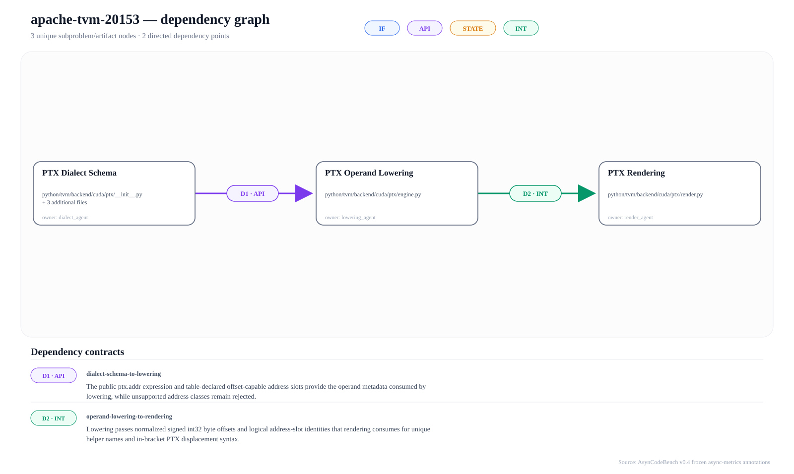

Canonical annotation: [`manifests/candidates/pr_hard_v0.4/metrics/apache_tvm_20153_async_metrics.json`](../../manifests/candidates/pr_hard_v0.4/metrics/apache_tvm_20153_async_metrics.json)

#### D1. dialect-schema-to-lowering [API]

- Direction: `ptx_dialect_schema` → `ptx_operand_lowering`
- Ownership: `dialect_agent` → `lowering_agent`
- Contract: The public ptx.addr expression and table-declared offset-capable address slots provide the operand metadata consumed by lowering, while unsupported address classes remain rejected.
- Resolution: Not separately recorded.

<details>
<summary>Exact checker mapping</summary>

**Upstream (2)**

- `tests/python/tirx/codegen/test_ptx_addr.py::test_ptx_addr_registration_and_table_capabilities`
- `tests/python/tirx/codegen/test_ptx_addr.py::test_ptx_addr_table_validation_rejects_wrong_operand_classes`

**Downstream (2)**

- `tests/python/tirx/codegen/test_ptx_addr.py::test_ptx_addr_coercion_ir_order_and_shared_codegen`
- `tests/python/tirx/codegen/test_ptx_addr.py::test_ptx_addr_pointer_and_raw_address_validation`

**Integrated (1)**

- `tests/python/tirx/codegen/test_ptx_addr.py::test_ptx_addr_scalar_vector_cache_predicate_and_multi_address_codegen`

</details>

#### D2. operand-lowering-to-rendering [INT]

- Direction: `ptx_operand_lowering` → `ptx_rendering`
- Ownership: `lowering_agent` → `render_agent`
- Contract: Lowering passes normalized signed int32 byte offsets and logical address-slot identities that rendering consumes for unique helper names and in-bracket PTX displacement syntax.
- Resolution: Not separately recorded.

<details>
<summary>Exact checker mapping</summary>

**Upstream (2)**

- `tests/python/tirx/codegen/test_ptx_addr.py::test_ptx_addr_offset_type_and_range_rejections`
- `tests/python/tirx/codegen/test_ptx_addr.py::test_ptx_addr_unrolled_expression_and_dynamic_rejection`

**Downstream (1)**

- `tests/python/tirx/codegen/test_ptx_addr.py::test_ptx_addr_zero_sign_boundaries_and_helper_names`

**Integrated (2)**

- `tests/python/tirx/codegen/test_ptx_addr.py::test_ptx_addr_scalar_vector_cache_predicate_and_multi_address_codegen`
- `tests/python/tirx/codegen/test_ptx_addr.py::test_ptx_addr_printer_script_and_json_roundtrip`

</details>

## Rebuild

```bash
cd /home/kzhang42/AsyncCodeBench
python scripts/build_20task_dependency_catalog.py
```
