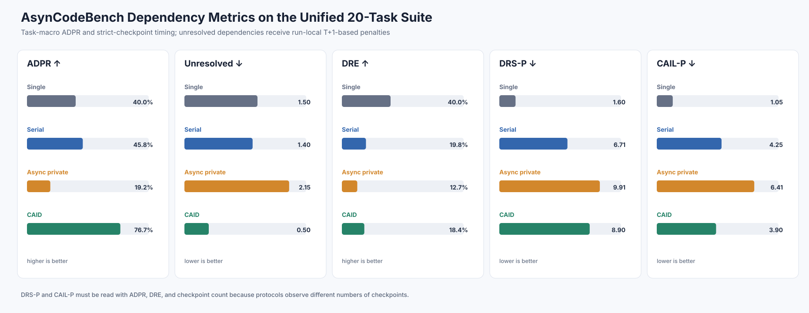
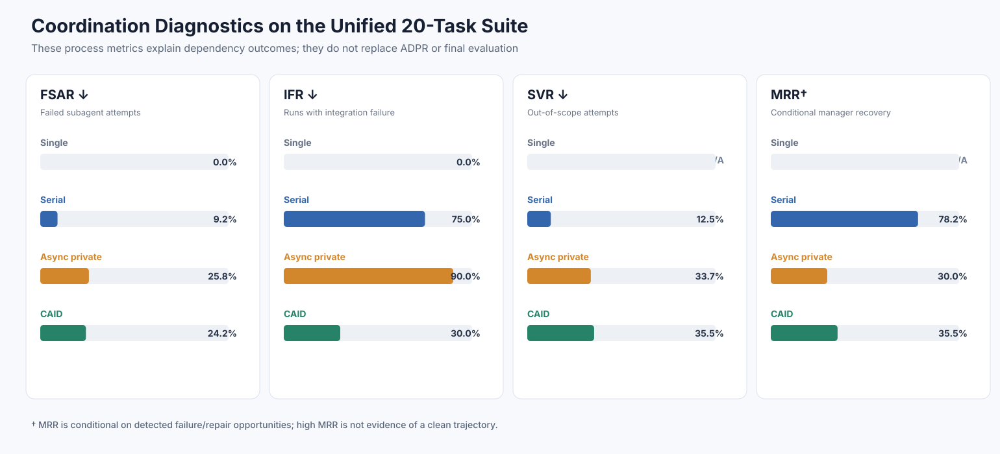
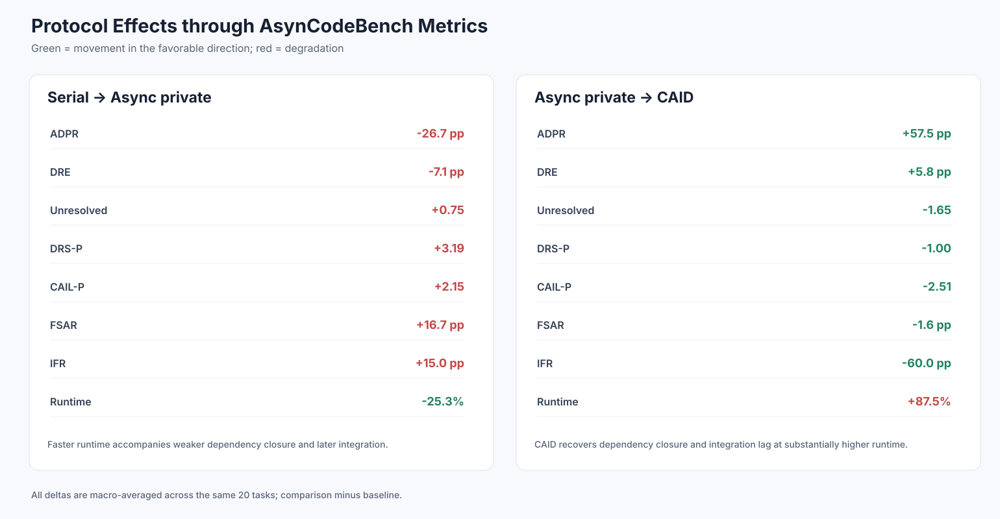
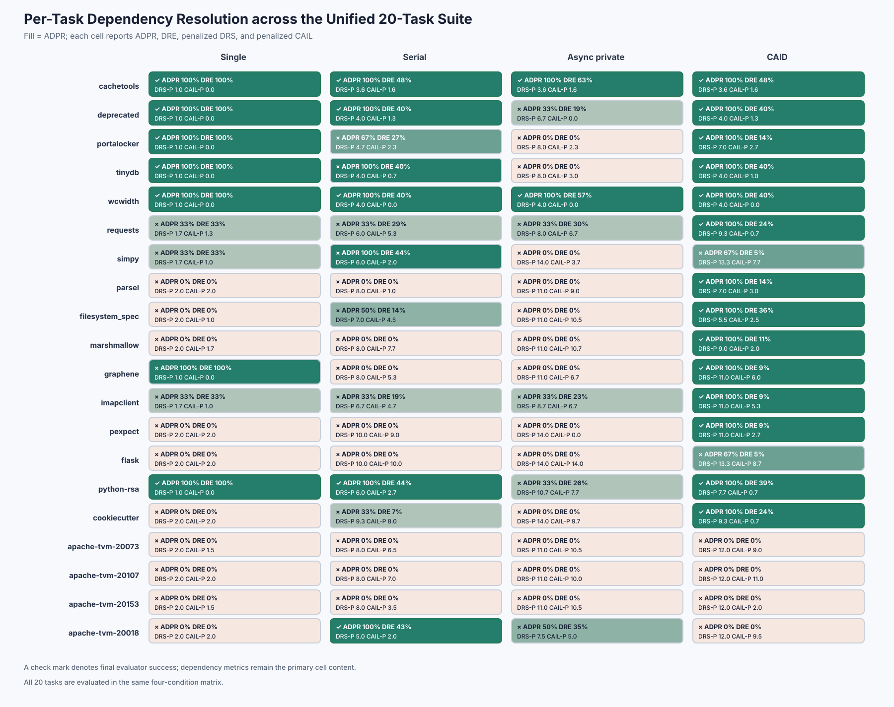

# Qwen3.6-27B: Unified 20-Task AsynCodeBench Analysis

## Scope

This report treats the benchmark as one unified suite of 20 repository-engineering tasks produced through the AsynCodeBench transformation and qualification pipeline. Every task enters the same four-condition analysis and the same aggregate population.

The analysis contains 80 frozen task-condition cells: Single, Serial specialists, Async private, and CAID for each task. There is one selected run per cell, so solved-task fractions are descriptive and are not repeated-seed FSR estimates.

## Metric hierarchy

| Level | Metrics | Paper role |
| --- | --- | --- |
| Core dependency outcomes | ADPR, unresolved dependencies | Primary benchmark result |
| Dependency timing | strict-checkpoint DRS-P, CAIL-P, DRE | When and how efficiently dependencies close |
| Stale-information behavior | strict SAD/SAR | Primary concept, reported only with sufficient visibility evidence |
| Coordination diagnostics | FSAR, IFR, SVR, MRR | Explain artifact, integration, ownership, and recovery behavior |
| Conventional outcomes | final success, pass rate, tokens, runtime | Supporting context only |

Macro ADPR averages task-level dependency pass rates so that every task has equal weight. Micro ADPR pools all labeled dependency edges. A dependency is resolved only when its required integrated checker group passes in the final integrated workspace.

Strict DRS is the first integrated-workspace checkpoint at which the dependency's integrated checker passes. DRS-P assigns an unresolved dependency step `T+1`. CAIL is the downstream resolution step minus the upstream resolution step; CAIL-P uses the benchmark's run-local piecewise penalty when either side remains unresolved. DRE normalizes penalized DRS by the number of observed checkpoints (`T`) so that step counts from protocols with different checkpoint schedules are more comparable.

## Table 1. Core AsynCodeBench dependency metrics

| Protocol | Macro ADPR ↑ | Micro ADPR ↑ | Full ADPR tasks | Unresolved/task ↓ | DRE ↑ | DRS-P ↓ | CAIL-P ↓ | Checkpoints | SAD/SAR |
| --- | ---: | ---: | ---: | ---: | ---: | ---: | ---: | ---: | ---: |
| Single | 40.0% | 45.5% (25/55) | 7/20 | 1.50 | 40.0% | 1.60 | 1.05 | 1.00 | N/A† |
| Serial | 45.8% | 49.1% (27/55) | 7/20 | 1.40 | 19.8% | 6.71 | 4.25 | 7.00 | N/A† |
| Async private | 19.2% | 21.8% (12/55) | 2/20 | 2.15 | 12.7% | 9.91 | 6.41 | 10.00 | N/A† |
| CAID | 76.7% | 81.8% (45/55) | 14/20 | 0.50 | 18.4% | 8.90 | 3.90 | 9.30 | N/A† |

† Strict SAD/SAR is not estimable for these runs because the traces do not provide complete producer-artifact version visibility for consumer attempts. Heuristic candidates are reported separately and are not substituted for strict SAD/SAR.

DRS-P and CAIL-P apply the benchmark's run-local `T+1`-based unresolved penalties. Since protocols have different checkpoint counts, cross-protocol timing must be interpreted with ADPR, unresolved count, DRE, and checkpoints rather than DRS-P alone.



## Table 2. Coordination diagnostics

| Protocol | FSAR ↓ | IFR ↓ | SVR ↓ | MRR‡ | SAD proxy candidates§ | Proxy-positive runs§ |
| --- | ---: | ---: | ---: | ---: | ---: | ---: |
| Single | 0.0% | 0.0% | N/A | N/A | 0 | 0.0% |
| Serial | 9.2% | 75.0% | 12.5% | 78.2% | 46 | 65.0% |
| Async private | 25.8% | 90.0% | 33.7% | 30.0% | 57 | 45.0% |
| CAID | 24.2% | 30.0% | 35.5% | 35.5% | 103 | 75.0% |

‡ MRR is conditional on detected failure or repair opportunities. A high recovery rate does not imply a clean trajectory and must be read with FSAR.

§ SAD proxy counts are conservative heuristic candidates requiring trajectory audit. They are sensitive to the number of attempts and must not be interpreted as strict SAD or SAR.



## CAID-centered outcome summary

CAID is the strongest complete condition in these selected runs: it solves 14/20 tasks and resolves 45/55 dependency edges. It uniquely solves 8 tasks that none of the three controls solve: `requests`, `parsel`, `filesystem_spec`, `marshmallow`, `graphene`, `imapclient`, `pexpect`, `cookiecutter`.

CAID has one observed regression against the controls: `apache-tvm-20018`. This effectiveness--boundary pattern should organize the paper results; the following pairwise contrasts are supporting analyses rather than standalone paper RQs.

## Supporting contrast A. Serial versus Async private

Compared with Serial, Async private changes ADPR by -26.7 percentage points, DRE by -7.1 points, unresolved dependencies by +0.75, DRS-P by +3.19, and CAIL-P by +2.15. FSAR rises by +16.7 points and IFR by +15.0 points.

Async private uses 0.75× the Serial runtime (-25.3%) but closes dependencies less reliably and later. The speed benefit is therefore accompanied by a measurable coordination penalty.

## Supporting contrast B. Async private versus CAID

Compared with Async private, CAID changes ADPR by +57.5 percentage points, reduces unresolved dependencies by 1.65, changes DRE by +5.8 points, DRS-P by -1.00, and CAIL-P by -2.51. IFR falls by 60.0 points.

This recovery costs 1.55× tokens and 1.88× runtime. CAID reaches 76.7% macro ADPR and resolves 45/55 edge instances, but increased cost and nonzero FSAR/SVR show that recovery is not free.



## Table 3. Conventional outcomes and resources

| Protocol | Solved tasks | Mean pass | Mean tokens | Mean runtime |
| --- | ---: | ---: | ---: | ---: |
| Single | 6/20 (30.0%) | 59.2% | 5.000M | 63.9 min |
| Serial | 5/20 (25.0%) | 61.5% | 8.127M | 136.9 min |
| Async private | 2/20 (10.0%) | 51.9% | 7.889M | 102.3 min |
| CAID | 14/20 (70.0%) | 93.2% | 12.221M | 191.8 min |

These conventional measures are necessary context, but they are not the benchmark contribution. In particular, a high evaluator pass rate can coexist with low ADPR and unresolved producer-consumer contracts.

## Table 4. Per-task dependency matrix

Each cell is `final success; A=ADPR; E=DRE; R=DRS-P; L=CAIL-P`.

| Task | Single | Serial | Async private | CAID |
| --- | --- | --- | --- | --- |
| cachetools | ✓; A=100%; E=100%; R=1.0; L=0.0 | ✓; A=100%; E=48%; R=3.6; L=1.6 | ✓; A=100%; E=63%; R=3.6; L=1.6 | ✓; A=100%; E=48%; R=3.6; L=1.6 |
| deprecated | ✓; A=100%; E=100%; R=1.0; L=0.0 | ✓; A=100%; E=40%; R=4.0; L=1.3 | ×; A=33%; E=19%; R=6.7; L=0.0 | ✓; A=100%; E=40%; R=4.0; L=1.3 |
| portalocker | ✓; A=100%; E=100%; R=1.0; L=0.0 | ×; A=67%; E=27%; R=4.7; L=2.3 | ×; A=0%; E=0%; R=8.0; L=2.3 | ✓; A=100%; E=14%; R=7.0; L=2.7 |
| tinydb | ✓; A=100%; E=100%; R=1.0; L=0.0 | ×; A=100%; E=40%; R=4.0; L=0.7 | ×; A=0%; E=0%; R=8.0; L=3.0 | ✓; A=100%; E=40%; R=4.0; L=1.0 |
| wcwidth | ✓; A=100%; E=100%; R=1.0; L=0.0 | ✓; A=100%; E=40%; R=4.0; L=0.0 | ✓; A=100%; E=57%; R=4.0; L=0.0 | ✓; A=100%; E=40%; R=4.0; L=0.0 |
| requests | ×; A=33%; E=33%; R=1.7; L=1.3 | ×; A=33%; E=29%; R=6.0; L=5.3 | ×; A=33%; E=30%; R=8.0; L=6.7 | ✓; A=100%; E=24%; R=9.3; L=0.7 |
| simpy | ×; A=33%; E=33%; R=1.7; L=1.0 | ×; A=100%; E=44%; R=6.0; L=2.0 | ×; A=0%; E=0%; R=14.0; L=3.7 | ×; A=67%; E=5%; R=13.3; L=7.7 |
| parsel | ×; A=0%; E=0%; R=2.0; L=2.0 | ×; A=0%; E=0%; R=8.0; L=1.0 | ×; A=0%; E=0%; R=11.0; L=9.0 | ✓; A=100%; E=14%; R=7.0; L=3.0 |
| filesystem_spec | ×; A=0%; E=0%; R=2.0; L=1.0 | ×; A=50%; E=14%; R=7.0; L=4.5 | ×; A=0%; E=0%; R=11.0; L=10.5 | ✓; A=100%; E=36%; R=5.5; L=2.5 |
| marshmallow | ×; A=0%; E=0%; R=2.0; L=1.7 | ×; A=0%; E=0%; R=8.0; L=7.7 | ×; A=0%; E=0%; R=11.0; L=10.7 | ✓; A=100%; E=11%; R=9.0; L=2.0 |
| graphene | ×; A=100%; E=100%; R=1.0; L=0.0 | ×; A=0%; E=0%; R=8.0; L=5.3 | ×; A=0%; E=0%; R=11.0; L=6.7 | ✓; A=100%; E=9%; R=11.0; L=6.0 |
| imapclient | ×; A=33%; E=33%; R=1.7; L=1.0 | ×; A=33%; E=19%; R=6.7; L=4.7 | ×; A=33%; E=23%; R=8.7; L=6.7 | ✓; A=100%; E=9%; R=11.0; L=5.3 |
| pexpect | ×; A=0%; E=0%; R=2.0; L=2.0 | ×; A=0%; E=0%; R=10.0; L=9.0 | ×; A=0%; E=0%; R=14.0; L=0.0 | ✓; A=100%; E=9%; R=11.0; L=2.7 |
| flask | ×; A=0%; E=0%; R=2.0; L=2.0 | ×; A=0%; E=0%; R=10.0; L=10.0 | ×; A=0%; E=0%; R=14.0; L=14.0 | ×; A=67%; E=5%; R=13.3; L=8.7 |
| python-rsa | ✓; A=100%; E=100%; R=1.0; L=0.0 | ✓; A=100%; E=44%; R=6.0; L=2.7 | ×; A=33%; E=26%; R=10.7; L=7.7 | ✓; A=100%; E=39%; R=7.7; L=0.7 |
| cookiecutter | ×; A=0%; E=0%; R=2.0; L=2.0 | ×; A=33%; E=7%; R=9.3; L=8.0 | ×; A=0%; E=0%; R=14.0; L=9.7 | ✓; A=100%; E=24%; R=9.3; L=0.7 |
| apache-tvm-20073 | ×; A=0%; E=0%; R=2.0; L=1.5 | ×; A=0%; E=0%; R=8.0; L=6.5 | ×; A=0%; E=0%; R=11.0; L=10.5 | ×; A=0%; E=0%; R=12.0; L=9.0 |
| apache-tvm-20107 | ×; A=0%; E=0%; R=2.0; L=2.0 | ×; A=0%; E=0%; R=8.0; L=7.0 | ×; A=0%; E=0%; R=11.0; L=10.0 | ×; A=0%; E=0%; R=12.0; L=11.0 |
| apache-tvm-20153 | ×; A=0%; E=0%; R=2.0; L=1.5 | ×; A=0%; E=0%; R=8.0; L=3.5 | ×; A=0%; E=0%; R=11.0; L=10.5 | ×; A=0%; E=0%; R=12.0; L=2.0 |
| apache-tvm-20018 | ×; A=0%; E=0%; R=2.0; L=2.0 | ✓; A=100%; E=43%; R=5.0; L=2.0 | ×; A=50%; E=35%; R=7.5; L=5.0 | ×; A=0%; E=0%; R=12.0; L=9.5 |



## Paper-ready findings

1. CAID is the strongest overall condition: 14/20 solved tasks, 45/55 resolved edges, and 8 CAID-only task successes.
2. The CAID gain is conditional rather than universal: it resolves 45/47 edges on the 16 non-compiler tasks but 0/8 compiler/IR edges, while Serial alone solves `apache-tvm-20018`.
3. Final pass rate alone is insufficient: ADPR identifies whether labeled cross-agent contracts close, while DRS/CAIL/DRE reveal when and how efficiently they close.
4. Serial versus Async private and Async private versus CAID remain useful controlled contrasts, but they support the overall effectiveness analysis rather than defining separate paper RQs.
5. Strict SAD/SAR remains unreported rather than imputed. This is an instrumentation limitation, not evidence of zero stale assumptions.
6. In task `apache-tvm-20018`, all five CAID specialist attempts reach the fixed 100-iteration cap without solving the task, providing a concrete capability/cost-boundary case study.

Do not claim seed-level statistical significance or strict SAD/SAR values from these single selected runs. Use the heuristic stale-assumption candidates only for audited case studies.

## Reproduction

```bash
cd /home/kzhang42/AsyncCodeBench
python scripts/build_qwen36_20task_paper_analysis.py
```

The builder verifies all frozen artifact hashes before computing the unified metrics.
