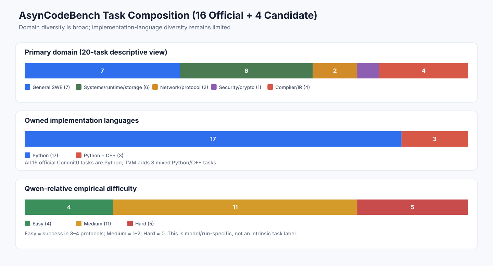
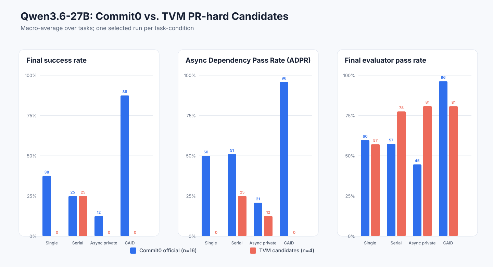
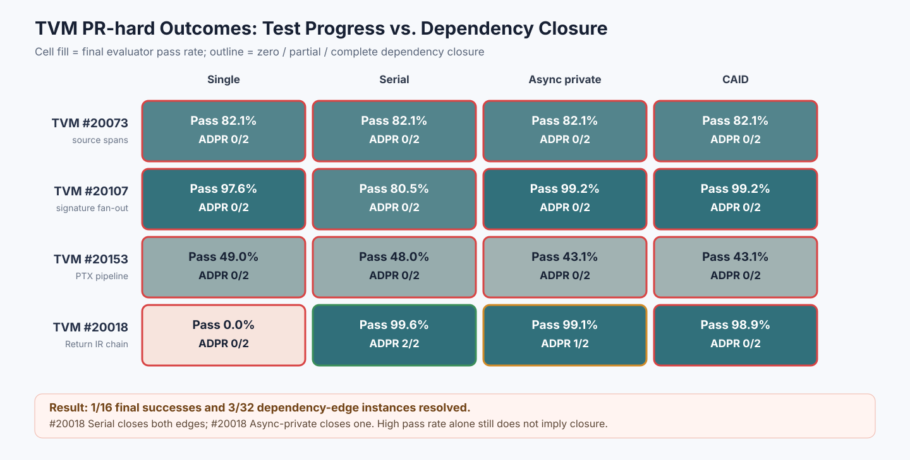

# Qwen3.6-27B on AsynCodeBench Commit0 and TVM PR-hard Candidates

## Bottom line

This analysis separates the **16 official Commit0 v0.3 tasks** from the **4 non-official TVM PR-hard v0.4 candidates**. The latter remain pending mandatory human review and have `official_result_eligible=false`; the 20-task view below is therefore descriptive rather than a new official release composition.

- Domain coverage is broad: 7 general SWE/framework, 6 systems/runtime/storage, 2 network/protocol, 1 security/cryptography, and 4 compiler/IR candidates.
- The tasks do **not** use 20 different languages. All 16 official tasks have Python-owned implementation surfaces. TVM #20073, #20107, and #20018 add mixed Python/C++ surfaces; TVM #20153 remains Python-owned while generating/interpreting TIRx and PTX artifacts.
- Commit0 contains 47 dependency edges (**2.94 per task**); the TVM candidates contain 8 (**2.0 per task**). The TVM edge count per task is lower, but each edge crosses deeper compiler layers such as Python/C++, FFI, parser, IR, and printer/code generation.
- On Commit0, CAID is the strongest condition: **14/16 final successes (87.5%)**, **96.3%** mean evaluator pass rate, and **95.8% ADPR**.
- On the 4 TVM candidates, Qwen records **1/16 final successes** and resolves **3/32 dependency-edge instances** across four conditions. The only full success is #20018 under Serial; TVM remains substantially harder for this model under these runs.
- The corrected #20018 CAID termination statistic is **5/5 specialist attempts hitting the fixed 100-iteration cap**. The correction is SHA-pinned to the immutable source bundle and raw outputs.
- TVM #20107 is the key diagnostic example: async-private and CAID both pass **499/503 (99.2%)** evaluator tests but still have **ADPR 0/2** because the Relax and TIRx round-trip contracts remain unresolved.



## Task taxonomy

The primary domain is assigned by the scoped evaluator and owned implementation work, not by every feature of the upstream project.

| Task | Lane | Primary domain | Fine-grained focus | Implementation language(s) | Edges | Specialists | Qwen tier |
| --- | --- | --- | --- | --- | ---: | ---: | --- |
| cachetools | Commit0 official | General SWE / framework | Caching and reusable utilities | Python | 5 | 2 | Easy (4/4) |
| deprecated | Commit0 official | General SWE / framework | Decorators and documentation compatibility | Python | 3 | 2 | Easy (3/4) |
| portalocker | Commit0 official | Systems / runtime / storage | OS file locking and concurrency | Python | 3 | 2 | Medium (2/4) |
| tinydb | Commit0 official | Systems / runtime / storage | Embedded database and persistence | Python | 3 | 2 | Medium (2/4) |
| wcwidth | Commit0 official | Systems / runtime / storage | Terminal and Unicode infrastructure | Python | 2 | 2 | Easy (4/4) |
| requests | Commit0 official | Network / protocol | HTTP client and transport | Python | 3 | 3 | Medium (1/4) |
| simpy | Commit0 official | Systems / runtime / storage | Discrete-event runtime | Python | 3 | 4 | Hard (0/4) |
| parsel | Commit0 official | General SWE / framework | Parsing and query processing | Python | 2 | 3 | Medium (1/4) |
| filesystem_spec | Commit0 official | Systems / runtime / storage | Filesystem and storage abstraction | Python | 2 | 3 | Medium (1/4) |
| marshmallow | Commit0 official | General SWE / framework | Schema and serialization framework | Python | 3 | 3 | Medium (1/4) |
| graphene | Commit0 official | General SWE / framework | Type-system and schema framework | Python | 3 | 3 | Medium (1/4) |
| imapclient | Commit0 official | Network / protocol | IMAP protocol client | Python | 3 | 3 | Medium (1/4) |
| pexpect | Commit0 official | Systems / runtime / storage | Process, PTY, and asynchronous I/O | Python | 3 | 4 | Medium (1/4) |
| flask | Commit0 official | General SWE / framework | Web application framework | Python | 3 | 4 | Hard (0/4) |
| python-rsa | Commit0 official | Security / cryptography | Public-key cryptography | Python | 3 | 4 | Easy (3/4) |
| cookiecutter | Commit0 official | General SWE / framework | Developer tooling and workflow automation | Python | 3 | 4 | Medium (1/4) |
| apache-tvm-20073 | TVM candidate | Compiler / IR engineering | Source spans across IRBuilder, parser, evaluator, and TIRx | Python + C++ | 2 | 3 | Hard (0/4) |
| apache-tvm-20107 | TVM candidate | Compiler / IR engineering | Generic Script signatures with Relax/TIRx parser-printer fan-out | Python + C++ | 2 | 3 | Hard (0/4) |
| apache-tvm-20153 | TVM candidate | Compiler / IR engineering | PTX dialect schema, lowering, and rendering | Python | 2 | 3 | Hard (0/4) |
| apache-tvm-20018 | TVM candidate | Compiler / IR engineering | Return IR schema, TVMScript surface, lowering, and target emission | Python + C++ | 2 | 3 | Medium (1/4) |

### Domain and language totals

| View | Category | Count | Share of 20 |
| --- | --- | ---: | ---: |
| Domain | General SWE / framework | 7 | 35.0% |
| Domain | Systems / runtime / storage | 6 | 30.0% |
| Domain | Network / protocol | 2 | 10.0% |
| Domain | Security / cryptography | 1 | 5.0% |
| Domain | Compiler / IR engineering | 4 | 20.0% |
| Owned language | Python | 17 | 85.0% |
| Owned language | Python + C++ | 3 | 15.0% |

TIRx, Relax IR, TVMScript, and PTX are important compiler-stack artifacts, but they should not be counted as additional implementation languages in this table. The accurate claim is that TVM increases **cross-layer and cross-language depth**, while the benchmark remains Python-heavy.

## Easy / medium / hard classification

To avoid a subjective label, the table uses a Qwen-specific empirical rule based only on final evaluator success across the four matched conditions:

- **Easy:** success in 3–4 protocols.
- **Medium:** success in 1–2 protocols.
- **Hard:** success in 0 protocols.

This is **not an intrinsic benchmark difficulty label**. It depends on this model, these selected runs, and the protocol set. In particular, a task solved only by CAID is Medium rather than Easy.

| Tier | Count | Tasks |
| --- | ---: | --- |
| Easy | 4 | cachetools, deprecated, python-rsa, wcwidth |
| Medium | 11 | apache-tvm-20018, cookiecutter, filesystem_spec, graphene, imapclient, marshmallow, parsel, pexpect, portalocker, requests, tinydb |
| Hard | 5 | apache-tvm-20073, apache-tvm-20107, apache-tvm-20153, flask, simpy |

## Complete task-condition matrix

Each cell reports `final success; evaluator pass rate; resolved edges / total edges`. A cross means the task is not solved even when its partial pass rate is high.

| Task | Result provenance | Single | Serial | Async private | CAID |
| --- | --- | ---: | ---: | ---: | ---: |
| cachetools | official selected bundle | ✓; 100.0%; 5/5 | ✓; 100.0%; 5/5 | ✓; 100.0%; 5/5 | ✓; 100.0%; 5/5 |
| deprecated | official selected bundle | ✓; 100.0%; 3/3 | ✓; 100.0%; 3/3 | ✗; 69.0%; 1/3 | ✓; 100.0%; 3/3 |
| portalocker | official selected bundle | ✓; 100.0%; 3/3 | ✗; 72.5%; 2/3 | ✗; 20.0%; 0/3 | ✓; 100.0%; 3/3 |
| tinydb | official selected bundle | ✓; 99.5%; 3/3 | ✗; 98.5%; 3/3 | ✗; 21.9%; 0/3 | ✓; 99.5%; 3/3 |
| wcwidth | official selected bundle | ✓; 94.9%; 2/2 | ✓; 94.9%; 2/2 | ✓; 94.9%; 2/2 | ✓; 94.9%; 2/2 |
| requests | official selected bundle | ✗; 0.0%; 1/3 | ✗; 0.0%; 1/3 | ✗; 86.4%; 1/3 | ✓; 94.7%; 3/3 |
| simpy | official selected bundle | ✗; 71.3%; 1/3 | ✗; 90.0%; 3/3 | ✗; 56.0%; 0/3 | ✗; 82.0%; 2/3 |
| parsel | official selected bundle | ✗; 19.2%; 0/2 | ✗; 11.5%; 0/2 | ✗; 18.8%; 0/2 | ✓; 99.0%; 2/2 |
| filesystem_spec | official selected bundle | ✗; 57.1%; 0/2 | ✗; 53.6%; 1/2 | ✗; 4.3%; 0/2 | ✓; 95.7%; 2/2 |
| marshmallow | official selected bundle | ✗; 27.3%; 0/3 | ✗; 26.0%; 0/3 | ✗; 0.0%; 0/3 | ✓; 100.0%; 3/3 |
| graphene | official selected bundle | ✗; 93.2%; 3/3 | ✗; 35.6%; 0/3 | ✗; 57.6%; 0/3 | ✓; 98.3%; 3/3 |
| imapclient | official selected bundle | ✗; 24.9%; 1/3 | ✗; 35.8%; 1/3 | ✗; 0.0%; 1/3 | ✓; 100.0%; 3/3 |
| pexpect | official selected bundle | ✗; 0.0%; 0/3 | ✗; 6.5%; 0/3 | ✗; 24.7%; 0/3 | ✓; 100.0%; 3/3 |
| flask | official selected bundle | ✗; 9.0%; 0/3 | ✗; 16.8%; 0/3 | ✗; 17.2%; 0/3 | ✗; 80.7%; 2/3 |
| python-rsa | official selected bundle | ✓; 100.0%; 3/3 | ✓; 100.0%; 3/3 | ✗; 65.2%; 1/3 | ✓; 100.0%; 3/3 |
| cookiecutter | official selected bundle | ✗; 59.5%; 0/3 | ✗; 77.6%; 1/3 | ✗; 78.0%; 0/3 | ✓; 96.6%; 3/3 |
| apache-tvm-20073 | candidate; frozen registry | ✗; 82.1%; 0/2 | ✗; 82.1%; 0/2 | ✗; 82.1%; 0/2 | ✗; 82.1%; 0/2 |
| apache-tvm-20107 | candidate; frozen registry | ✗; 97.6%; 0/2 | ✗; 80.5%; 0/2 | ✗; 99.2%; 0/2 | ✗; 99.2%; 0/2 |
| apache-tvm-20153 | candidate; frozen registry | ✗; 49.0%; 0/2 | ✗; 48.0%; 0/2 | ✗; 43.1%; 0/2 | ✗; 43.1%; 0/2 |
| apache-tvm-20018 | candidate; current registry | ✗; 0.0%; 0/2 | ✓; 99.6%; 2/2 | ✗; 99.1%; 1/2 | ✗; 98.9%; 0/2 |

## Qwen3.6-27B results by protocol



Each row is a macro-average over tasks, so the large TVM #20107 evaluator does not dominate the other TVM tasks.

| Lane | Protocol | Final success | Pass | ADPR | Unresolved | DRS penalized ↓ | CAIL penalized ↓ | DRE ↑ | FSAR ↓ | IFR ↓ | SVR ↓ | MRR ↑ | Cap hits | Tokens | Runtime |
| --- | --- | ---: | ---: | ---: | ---: | ---: | ---: | ---: | ---: | ---: | ---: | ---: | ---: | ---: | ---: |
| Commit0 official v0.3 | Single | 6/16 (37.5%) | 59.8% | 50.0% | 1.375 | 1.500 | 0.875 | 50.0% | 0.0% | 0.0% | N/A | N/A | N/A | 4.702M | 67.3 min |
| Commit0 official v0.3 | Serial | 4/16 (25.0%) | 57.5% | 51.0% | 1.375 | 6.579 | 4.131 | 22.1% | 5.2% | 75.0% | 11.5% | 85.2% | N/A | 7.615M | 133.2 min |
| Commit0 official v0.3 | Async private | 2/16 (12.5%) | 44.6% | 20.8% | 2.250 | 9.850 | 5.756 | 13.6% | 17.7% | 87.5% | 31.8% | 40.9% | N/A | 7.576M | 109.5 min |
| Commit0 official v0.3 | CAID | 14/16 (87.5%) | 96.3% | 95.8% | 0.125 | 8.131 | 2.902 | 23.1% | 14.1% | 12.5% | 34.4% | 45.7% | N/A | 10.872M | 196.3 min |
| TVM PR-hard candidate v0.4 | Single | 0/4 (0.0%) | 57.2% | 0.0% | 2.000 | 2.000 | 1.750 | 0.0% | 0.0% | 0.0% | N/A | N/A | 4/4 (100.0%) | 6.192M | 50.2 min |
| TVM PR-hard candidate v0.4 | Serial | 1/4 (25.0%) | 77.6% | 25.0% | 1.500 | 7.250 | 4.750 | 10.7% | 25.0% | 75.0% | 16.7% | 62.5% | 0/12 (0.0%) | 10.174M | 151.9 min |
| TVM PR-hard candidate v0.4 | Async private | 0/4 (0.0%) | 80.9% | 12.5% | 1.750 | 10.125 | 9.000 | 8.8% | 58.3% | 100.0% | 41.7% | 0.0% | 0/12 (0.0%) | 9.140M | 73.3 min |
| TVM PR-hard candidate v0.4 | CAID | 0/4 (0.0%) | 80.8% | 0.0% | 2.000 | 12.000 | 7.875 | 0.0% | 65.0% | 100.0% | 40.0% | 10.0% | 5/20 (25.0%) | 17.616M | 173.7 min |

### How to read the proposed metrics

- **Final success / pass rate** measures the final public evaluator. Pass rate captures partial progress but is not a solved-task criterion.
- **ADPR** is resolved dependency points divided by all dependency points. It requires the integrated checker group for an edge to pass.
- **DRS penalized** assigns unresolved edges checkpoint `T+1`; lower is better. **DRE** normalizes resolution timing; unresolved edges receive zero.
- **CAIL penalized** measures consumer lag after producer behavior becomes available, and penalizes a consumer that never catches up; lower is better.
- **FSAR, IFR, SVR, MRR** diagnose failed specialist artifacts, semantic/textual integration failure, ownership-scope violations, and manager recovery. For single-agent runs, SVR and MRR are structurally not applicable.
- **Cap hits** counts specialist attempts that consume the fixed 100-iteration budget. It is a cost/capability diagnostic, not an infrastructure failure.

Strict raw DRS is observed for 3/32 TVM edge instances: both #20018 Serial edges and one #20018 Async-private edge. Penalized DRS/CAIL and DRE retain the remaining 29 unresolved instances in aggregate instead of dropping them as missing data.
The TVM penalized values in this report are deterministically derived from each frozen `strict_dependency_metrics.json` using the current formulas in `docs/EVALUATION_METRICS.md`.

## TVM candidate detail



| Task | Topology | Protocol | Final result | ADPR | DRS penalty | CAIL penalty | FSAR | IFR | SVR | MRR |
| --- | --- | --- | ---: | ---: | ---: | ---: | ---: | ---: | ---: | ---: |
| apache-tvm-20073 | 2 producers → parser/evaluator consumer | Single | 23/28 (82.1%) | 0/2 | 2.00 | 1.50 | 0.0% | 0.0% | N/A | N/A |
| apache-tvm-20073 | 2 producers → parser/evaluator consumer | Serial | 23/28 (82.1%) | 0/2 | 8.00 | 6.50 | 33.3% | 100.0% | 33.3% | 50.0% |
| apache-tvm-20073 | 2 producers → parser/evaluator consumer | Async private | 23/28 (82.1%) | 0/2 | 11.00 | 10.50 | 66.7% | 100.0% | 33.3% | 0.0% |
| apache-tvm-20073 | 2 producers → parser/evaluator consumer | CAID | 23/28 (82.1%) | 0/2 | 12.00 | 9.00 | 60.0% | 100.0% | 40.0% | 0.0% |
| apache-tvm-20107 | shared Script core → Relax + TIRx fan-out | Single | 121/124 (97.6%) | 0/2 | 2.00 | 2.00 | 0.0% | 0.0% | N/A | N/A |
| apache-tvm-20107 | shared Script core → Relax + TIRx fan-out | Serial | 235/292 (80.5%) | 0/2 | 8.00 | 7.00 | 33.3% | 100.0% | 0.0% | 50.0% |
| apache-tvm-20107 | shared Script core → Relax + TIRx fan-out | Async private | 499/503 (99.2%) | 0/2 | 11.00 | 10.00 | 66.7% | 100.0% | 33.3% | 0.0% |
| apache-tvm-20107 | shared Script core → Relax + TIRx fan-out | CAID | 499/503 (99.2%) | 0/2 | 12.00 | 11.00 | 80.0% | 100.0% | 40.0% | 0.0% |
| apache-tvm-20153 | schema → lowering → rendering chain | Single | 50/102 (49.0%) | 0/2 | 2.00 | 1.50 | 0.0% | 0.0% | N/A | N/A |
| apache-tvm-20153 | schema → lowering → rendering chain | Serial | 49/102 (48.0%) | 0/2 | 8.00 | 3.50 | 33.3% | 100.0% | 33.3% | 50.0% |
| apache-tvm-20153 | schema → lowering → rendering chain | Async private | 44/102 (43.1%) | 0/2 | 11.00 | 10.50 | 66.7% | 100.0% | 66.7% | 0.0% |
| apache-tvm-20153 | schema → lowering → rendering chain | CAID | 44/102 (43.1%) | 0/2 | 12.00 | 2.00 | 60.0% | 100.0% | 80.0% | 0.0% |
| apache-tvm-20018 | Return IR → TVMScript → lowering/codegen chain | Single | 0/1 (0.0%) | 0/2 | 2.00 | 2.00 | 0.0% | 0.0% | N/A | N/A |
| apache-tvm-20018 | Return IR → TVMScript → lowering/codegen chain | Serial | 782/785 (99.6%) | 2/2 | 5.00 | 2.00 | 0.0% | 0.0% | 0.0% | 100.0% |
| apache-tvm-20018 | Return IR → TVMScript → lowering/codegen chain | Async private | 778/785 (99.1%) | 1/2 | 7.50 | 5.00 | 33.3% | 100.0% | 33.3% | 0.0% |
| apache-tvm-20018 | Return IR → TVMScript → lowering/codegen chain | CAID | 776/785 (98.9%) | 0/2 | 12.00 | 9.50 | 60.0% | 100.0% | 0.0% | 40.0% |

The four topologies are deliberately different: #20073 is a two-producer join, #20107 is a shared-core fan-out, and #20153 and #20018 are sequential compiler pipelines over different surfaces. All have two dependency edges, but edge count alone understates their Python/C++/FFI/parser/IR/printer/lowering depth.

## Interpretation

1. **The TVM extension increases empirical difficulty for Qwen3.6-27B.** Commit0 has 26 successful task-condition pairs out of 64, while TVM has 1 out of 16. TVM resolves only 3/32 labeled edge instances.
2. **The best coordination condition is task-dependent at TVM difficulty.** CAID dominates the Commit0 lane, but #20018 is solved only by Serial (2/2 edges); Async-private closes one edge and CAID closes none. The fixed 100-iteration cap is therefore exposing a real capability/cost limit rather than guaranteeing that more manager work succeeds.
3. **Pass rate and dependency closure answer different questions.** The 99.2% pass rate on #20107 async/CAID looks nearly solved, yet both exact round-trip edges fail. Conversely, #20018 Async-private passes 778/785 tests and closes only one of two edges. ADPR prevents either near-pass from being reported as complete integration.
4. **Do not claim significance or universal model hardness yet.** There is one selected run per task-condition, only 4 TVM candidates, and no confidence intervals or repeated seeds.

## Admission and data-quality caveats

- The 64 selected Commit0 bundles are valid and official-aggregate eligible, but the aggregate is **mixed-lineage**: four benchmark revisions and three generation-configuration hashes. It is descriptive, not a lineage-homogeneous official campaign.
- All 16 selected TVM bundles recorded generation-valid status at creation and use the standard-100 profile, but all 4 tasks remain candidate-lane and pending mandatory human review.
- Current checksum validation passes 4/16 TVM bundles against the latest whole-registry hash: #20018. The remaining bundles (#20073, #20107, #20153) report only `recorded_release_index_mismatch`; all other bundle checks pass. Because their run-relevant task/config/evaluator inputs were not changed, this report retains them as frozen-registry comparable results rather than treating the model measurements as invalid.
- For #20107 single and serial, raw pytest summaries contain 2 and 1 collection errors respectively, while `run_bundle.json` records `errors=0`. Final success is still false, but the bundle error field should be repaired before release use. The reported pass rate follows the frozen bundle convention (`passed / collected`).
- For #20018 CAID, all five raw specialist attempts reached the fixed 100-iteration cap. The frozen legacy summary recorded zero because it predates structured termination fields. This report applies `apache-tvm-20018-caid-legacy-cap-hit-v1`, a SHA-verified analysis-only correction; the source bundle is not rewritten and no model rerun is required.
- Process diagnostics such as SAD/SAR remain proxy-level unless structured visibility evidence or human trajectory audit is available; they are not used for the headline conclusion here.

## Reproduction

```bash
cd /home/kzhang42/AsyncCodeBench
python scripts/build_qwen36_commit0_tvm_analysis.py
```

Generated data files:

- `docs/results/qwen36_27_task_taxonomy.csv`
- `docs/results/qwen36_27_commit0_tvm_per_run.csv`
- `docs/results/qwen36_27_commit0_tvm_summary_by_protocol.csv`
- `docs/results/qwen36_27_statistical_corrections.v1.json`
- `docs/results/qwen36_27_frozen_result_index.v1.json`
