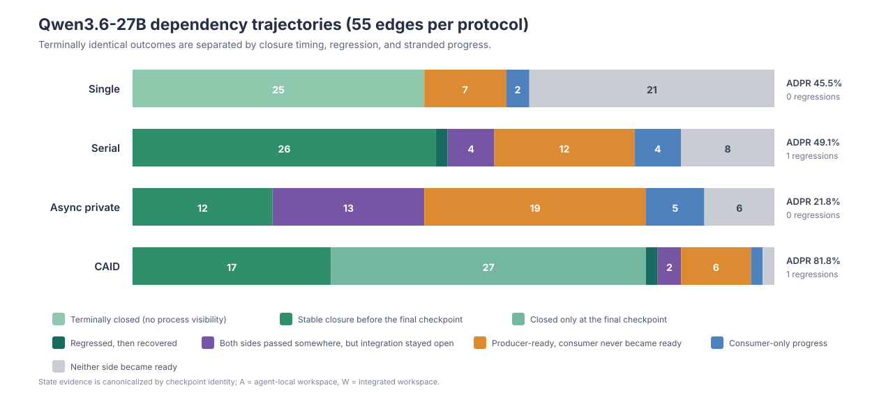
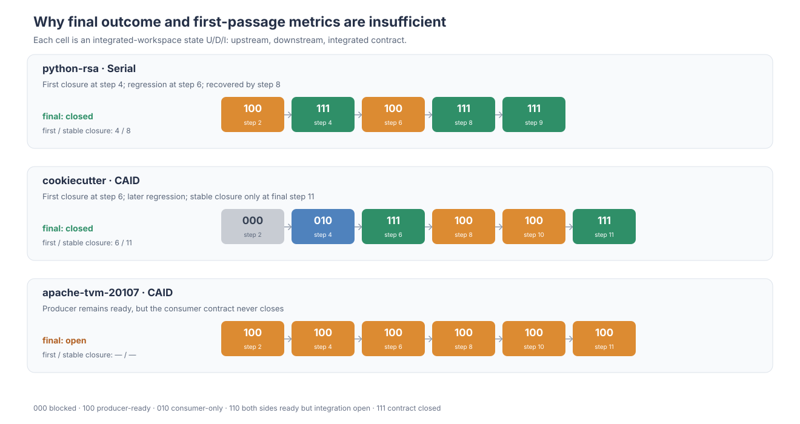

# Qwen3.6-27B Trajectory-Aware Analysis

## Main finding

Final test success and final ADPR substantially under-describe what happened during coordination. Across the frozen 20-task × 4-protocol matrix, trajectory evidence separates at least three phenomena that a terminal score merges: **capability failure**, **stranded local/producer progress**, and **non-monotonic integration with regression and recovery**.

The strongest result is the Async-private condition: it closes only **12/55** dependency edges, while **32/43 (74.4%)** of its final-open edges had already shown a passing upstream contract somewhere in the trajectory. Moreover, **12/43** open edges had passed the complete dependency checker in at least one agent-local workspace. Thus, many failures cannot be summarized as producer-side incapability: contract-ready or locally viable artifacts were observed but were not converted into final integrated closure. CAID converts substantially more edges to closure (**45/55**) and reduces the absolute number of producer-stranded failures from **32** to **8**. Of CAID's 45 closed edges, **27/45** close only at the final checkpoint, exposing the importance of final reconciliation rather than merely independent local completion.

## Metrics

For dependency edge \(d\), checkpoint \(k\) records \((U_{d,k},D_{d,k},I_{d,k})\): upstream, downstream, and integrated checker pass states. Checkpoints additionally identify whether they evaluate an agent-local workspace or the integrated workspace.

- **Final closure (ADPR component):** whether \(I=1\) at the final integrated checkpoint.
- **First closure step:** first integrated checkpoint with \(I=1\). This is the trajectory-normalized counterpart of first-passage DRS.
- **Stable closure step (SCS):** earliest integrated checkpoint after which \(I\) remains 1 through the final checkpoint.
- **Regression count (RC):** number of integrated-workspace transitions \(I:1\rightarrow0\).
- **Recovery:** a later \(I:0\rightarrow1\) after a regression.
- **Producer-stranded edge:** upstream passes at least once, but final integrated closure is 0.
- **Consumer-progress-stranded edge:** downstream passes at least once, but final integrated closure is 0.
- **Local-integrated-progress-stranded edge:** the integrated checker passes in an agent-local workspace at least once, but the edge is open in the final integrated workspace.

These are complementary to ADPR/DRS/CAIL. ADPR is a terminal projection; first-passage DRS records when closure first occurs; neither indicates whether closure is durable. Strict SAD is **not** reported because the current traces do not provide complete structured visibility of agent assumptions.

## Protocol-level results

| Protocol | Solved tasks | Final closed edges | Producer stranded / open | Consumer progress stranded | Local integrated progress stranded | Regression edges / recovered |
|---|---|---|---|---|---|---|
| Single | 6/20 | 25/55 (45.5%) | 7/30 (23.3%) | 2 | 0 | 0 / 0 |
| Serial | 5/20 | 27/55 (49.1%) | 16/28 (57.1%) | 8 | 5 | 1 / 1 |
| Async private | 2/20 | 12/55 (21.8%) | 32/43 (74.4%) | 18 | 12 | 0 / 0 |
| CAID | 14/20 | 45/55 (81.8%) | 8/10 (80.0%) | 3 | 2 | 1 / 1 |

“Regression edges / recovered” counts edges with at least one integrated \(1\rightarrow0\) transition and the subset finally recovered. The stranded columns are inclusive indicators, whereas the archetypes below are mutually exclusive.

## Mutually exclusive trajectory archetypes

| Protocol | Terminal closed | Stable early closure | Final-only closure | Regressed + recovered | Both sides but open | Producer only | Consumer only | Neither side |
|---|---|---|---|---|---|---|---|---|
| Single | 25 | 0 | 0 | 0 | 0 | 7 | 2 | 21 |
| Serial | 0 | 26 | 0 | 1 | 4 | 12 | 4 | 8 |
| Async private | 0 | 12 | 0 | 0 | 13 | 19 | 5 | 6 |
| CAID | 0 | 17 | 27 | 1 | 2 | 6 | 1 | 1 |

Single has only one final integrated checkpoint per task, so it provides terminal outcomes but cannot identify closure timing or regression. It should therefore be treated as an outcome baseline, not a process baseline.

## Dependency-type view

| Type | Edges | Async closed | Async producer stranded | Async local-checker stranded | CAID closed | CAID producer stranded | CAID final-only closures |
|---|---|---|---|---|---|---|---|
| IF | 22 | 7/22 | 14 | 5 | 18/22 | 3 | 9 |
| API | 17 | 3/17 | 11 | 4 | 14/17 | 3 | 10 |
| STATE | 7 | 0/7 | 3 | 2 | 6/7 | 1 | 5 |
| INT | 9 | 2/9 | 4 | 1 | 7/9 | 1 | 3 |

The type-level trajectory view sharpens the terminal result. Async-private closes **0/7 STATE** edges, while CAID closes **6/7**; five of those six CAID closures occur only at the final checkpoint. API exhibits a similar, though less extreme, pattern: CAID closes 14/17 edges and 10 close only at the final checkpoint. This is descriptive evidence that the advantage is concentrated in converting cross-artifact state/API obligations during reconciliation, not simply in producing more independently plausible patches.

## Cases hidden by point metrics

1. **python-rsa / Serial / inverse-prime contract.** Integrated states are `2:100 > 4:111 > 6:100 > 8:111 > 9:111`. The edge first closes at step 4, regresses at the serialization merge, and recovers later. Final ADPR marks it passed and first-passage DRS stops at step 4; only the trajectory reveals the regression-recovery cycle.
2. **cookiecutter / CAID / repository-directory contract.** Integrated states are `2:000 > 4:010 > 6:111 > 8:100 > 10:100 > 11:111`. It first closes at step 6, falls back to producer-only state, and becomes stably closed only at step 11. A final-only evaluation reports success; first-passage timing overstates how early the contract was safely resolved.
3. **apache-tvm-20107 / CAID / symbolic-signature contract.** Integrated states are `2:100 > 4:100 > 6:100 > 8:100 > 10:100 > 11:100`. The upstream remains ready, but the downstream never closes the contract. This is a persistent coordination boundary, not merely an undifferentiated failing test.

## What this supports in the paper

The defensible claim is not simply that multi-agent execution improves final accuracy. The evidence supports a more specific statement:

> AsyncCodeBench exposes whether independently useful implementation progress is converted into durable cross-agent contract closure. On Qwen3.6-27B, protocol choice changes not only how many tasks finish, but also whether producer progress becomes stranded and whether apparently resolved dependencies remain resolved.

This makes trajectory analysis the explanatory layer behind the final score. The main paper can use final success and ADPR as outcomes, then use stranded-progress and regression/stable-closure evidence to explain *why* protocols with similar-looking local progress diverge after integration.

## Canonicalization and scope

- Population: the frozen Qwen3.6-27B 20-task × 4-protocol matrix (80 runs; 55 dependency edges per protocol).
- Async-private logs contain **60** repeated records sharing an existing checkpoint identity. The canonical trace keeps the last observation for each `checkpoint_id`, restores `logical_step` order, and assigns dense canonical steps. No test outcome is synthesized.
- All repeated identities have identical dependency-checker outcomes; canonicalization therefore changes trace length/order but not observed edge states.
- Canonical checkpoint counts are used only for this trajectory analysis. Existing frozen strict DRS/CAIL values remain unchanged in the earlier paper tables.
- This is a one-run-per-cell descriptive analysis; it establishes observed mechanisms, not population-level variance or statistical significance.

Machine-readable outputs: `qwen36_27_trajectory_per_edge.csv`, `qwen36_27_trajectory_states.csv`, `qwen36_27_trajectory_protocol_summary.csv`, `qwen36_27_trajectory_type_summary.csv`, and `qwen36_27_trajectory_provenance.v1.json`.
