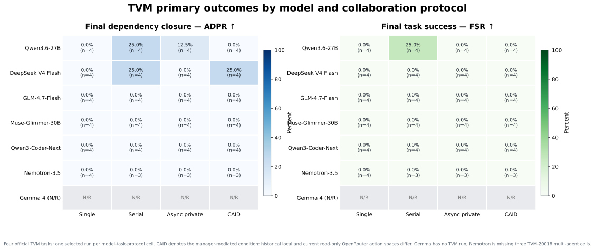
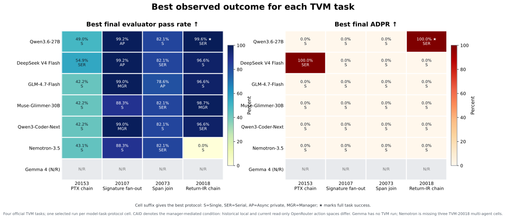
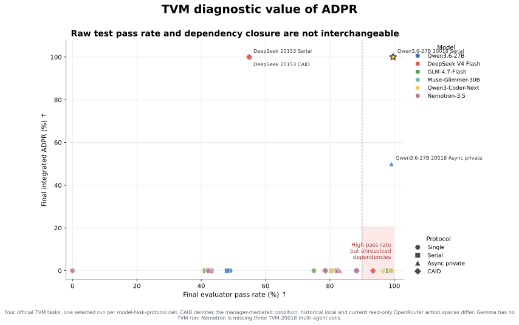
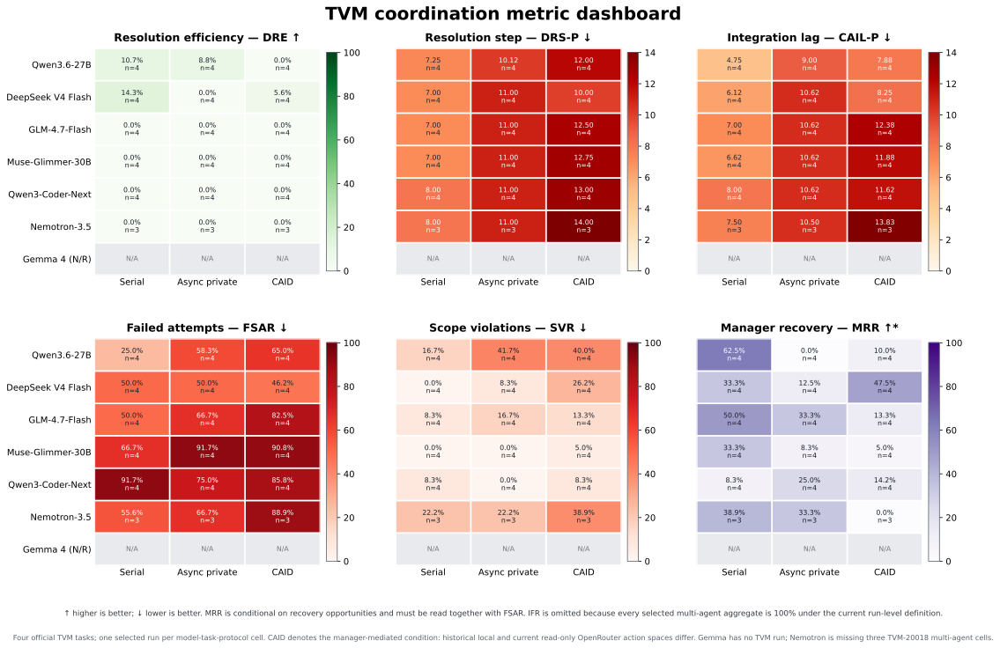
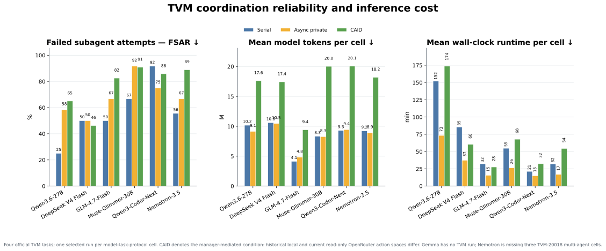

# Four-Task TVM Model Analysis

Audit date: 2026-09-04.

## Scope

This report compares the four official TVM tasks across the available local
model campaigns and the completed OpenRouter
`deepseek/deepseek-v4-flash-0731` campaign. The OpenRouter selection is the
controlled `openrouter-tvm-paper-cpu28-netguard-v02` rerun: all 16 cells are
valid, aggregate-eligible, on revision `73c9032`, limited to 28 CPUs and 28
Ninja jobs, and run with agent-terminal network access disabled.

The revision above is the value recorded by the native bundles. A subsequent
provenance audit found that the execution checkout also contained uncommitted
harness changes, so the SHA alone does not reconstruct the exact runner state.
The measurements remain immutable and pass the current bundle-health checks,
but they should be reported as a separately versioned extension campaign. A
strict same-revision 20-task comparison requires rerunning these four tasks
from a clean, pinned release checkout.

Gemma 4 has no TVM runs. Nemotron is missing the Serial, Async-private, and
manager conditions for `apache-tvm-20018`. All other listed model--task cells
have four protocols.

The complete 93-row per-run table is
[`tvm_four_task_all_model_per_run_20260904.csv`](tvm_four_task_all_model_per_run_20260904.csv).

## Presentation figures

The figures below use the common four-task TVM slice, so the local and
OpenRouter campaigns are compared on the same tasks. They label the
manager-mediated condition as **CAID**. This label describes the observed
experimental condition and does not infer that a manager authored production
changes merely because a historical harness exposed write capability. The
historical-local versus current-read-only action-space caveat is retained in
every figure footer.

### Primary benchmark outcomes

This is the recommended opening slide: Qwen Serial is the only full solve,
while Qwen and DeepSeek each produce additional non-zero dependency closure.

### Task-level capability frontier

This separates broad regression preservation from closure of the scoped
cross-layer contract. The strongest examples are TVM-20107, where several
models approach 99% Pass while ADPR remains zero, and TVM-20018, where Qwen
Serial reaches both full dependency closure and final success.

### Why ADPR is needed

The high-Pass/zero-ADPR cluster shows that conventional test pass rate cannot
replace dependency-aware evaluation. Non-zero ADPR points are explicitly
labeled; the star marks the only full task success.

### Coordination dynamics

This dashboard uses the benchmark's coordination metrics and prints the
direction of improvement in each title. MRR remains conditional on recovery
opportunities and must be interpreted together with FSAR.

### Reliability and inference cost

The resource panel is descriptive rather than a hardware-normalized speed
ranking: local and hosted deployments differ. Tokens are the cleaner
cross-deployment cost proxy; runtime should be reported with the deployment
caveat.

## Metric direction and interpretation

| Metric | Meaning | Direction |
| --- | --- | ---: |
| FSR | Final Success Rate | **Higher is better ↑** |
| Pass | Final evaluator tests passed / tests collected | **Higher is better ↑** |
| ADPR | Final integrated Async Dependency Pass Rate | **Higher is better ↑** |
| Unresolved/task | Mean final unresolved dependencies per task | **Lower is better ↓** |
| DRE | Checkpoint-normalized Dependency Resolution Efficiency | **Higher is better ↑** |
| DRS-P | Penalized Dependency Resolution Step | **Lower is better ↓** |
| CAIL-P | Penalized Cross-Agent Integration Lag | **Lower is better ↓** |
| FSAR | Failed Subagent Attempt Rate | **Lower is better ↓** |
| IFR | Integration Failure Rate | **Lower is better ↓** |
| SVR | Scope Violation Rate | **Lower is better ↓** |
| MRR | Manager Recovery Rate, conditional on recovery opportunities | **Higher is better ↑, conditionally** |
| Tokens | Mean model tokens per task cell | **Lower is better ↓ at matched quality** |
| Runtime | Mean wall-clock time per task cell | **Lower is better ↓ at matched quality** |
| API cost | Recorded provider cost | **Lower is better ↓ at matched quality** |
| Strict SAD/SAR | Stale-assumption duration/rate | **N/A for these traces** |

DRS-P and CAIL-P use the run-local `T+1` unresolved penalty. They must be read
with ADPR and DRE because the protocols expose different checkpoint counts.
MRR is not an unconditional quality score: a high value can coexist with many
failures and should be interpreted with FSAR.

## Per-task functional and dependency matrix

Each cell is `final success / Pass / ADPR`. `N/R` means not run. The Manager
column is CAID-RO for OpenRouter, historical CAID+Repair for the local models,
except that Qwen's TVM-20018 manager cell had a task-specific read-only guard.

### TVM-20153: PTX schema, lowering, and rendering chain

| Model | Single | Serial | Async private | Manager* |
| --- | ---: | ---: | ---: | ---: |
| Qwen3.6-27B | no / 49.0% / 0% | no / 48.0% / 0% | no / 43.1% / 0% | no / 43.1% / 0% |
| Gemma-4-26B-A4B | N/R | N/R | N/R | N/R |
| Muse-Glimmer-30B | no / 42.2% / 0% | no / 42.2% / 0% | no / 42.2% / 0% | no / 42.2% / 0% |
| Qwen3-Coder-Next-FP8 | no / 42.2% / 0% | no / 42.2% / 0% | no / 0% / 0% | no / 42.2% / 0% |
| NVIDIA Nemotron-3.5-Lightning | no / 43.1% / 0% | no / 43.1% / 0% | no / 43.1% / 0% | no / 42.2% / 0% |
| GLM-4.7-Flash | no / 42.2% / 0% | no / 41.2% / 0% | no / 42.2% / 0% | no / 42.2% / 0% |
| DeepSeek-V4-Flash-0731 (OpenRouter) | no / 43.1% / 0% | no / 54.9% / **100%** | no / 43.1% / 0% | no / 54.9% / **100%** |

DeepSeek Serial and CAID-RO close both dependency points. Each misses final
success because one broader regression remains:
`test_ptx_logic_shift_dispatch`. This is a near-solve with complete labeled
dependency closure, not an infrastructure failure.

### TVM-20107: shared-core signature fan-out

| Model | Single | Serial | Async private | Manager* |
| --- | ---: | ---: | ---: | ---: |
| Qwen3.6-27B | no / 97.6% / 0% | no / 80.5% / 0% | no / 99.2% / 0% | no / 99.2% / 0% |
| Gemma-4-26B-A4B | N/R | N/R | N/R | N/R |
| Muse-Glimmer-30B | no / 88.3% / 0% | no / 80.5% / 0% | no / 88.3% / 0% | no / 88.3% / 0% |
| Qwen3-Coder-Next-FP8 | no / 88.3% / 0% | no / 80.5% / 0% | no / 88.3% / 0% | no / 99.0% / 0% |
| NVIDIA Nemotron-3.5-Lightning | no / 88.3% / 0% | no / 88.3% / 0% | no / 83.1% / 0% | no / 88.3% / 0% |
| GLM-4.7-Flash | no / 88.3% / 0% | no / 88.3% / 0% | no / 80.5% / 0% | no / 99.0% / 0% |
| DeepSeek-V4-Flash-0731 (OpenRouter) | no / 88.3% / 0% | no / 88.3% / 0% | no / **99.2%** / 0% | no / **99.2%** / 0% |

DeepSeek Async and CAID-RO pass 499/503 tests but fail exactly the Relax and
TIRx type-variable round trips that instantiate the two labeled consumer
contracts. The near-perfect conventional pass rate and zero ADPR demonstrate
why ADPR is necessary.

### TVM-20073: two-producer span-propagation join

| Model | Single | Serial | Async private | Manager* |
| --- | ---: | ---: | ---: | ---: |
| Qwen3.6-27B | no / 82.1% / 0% | no / 82.1% / 0% | no / 82.1% / 0% | no / 82.1% / 0% |
| Gemma-4-26B-A4B | N/R | N/R | N/R | N/R |
| Muse-Glimmer-30B | no / 78.6% / 0% | no / 82.1% / 0% | no / 82.1% / 0% | no / 82.1% / 0% |
| Qwen3-Coder-Next-FP8 | no / 82.1% / 0% | no / 78.6% / 0% | no / 82.1% / 0% | no / 78.6% / 0% |
| NVIDIA Nemotron-3.5-Lightning | no / 78.6% / 0% | no / 82.1% / 0% | no / 82.1% / 0% | no / 78.6% / 0% |
| GLM-4.7-Flash | no / 75.0% / 0% | no / 0% / 0% | no / 78.6% / 0% | no / 0% / 0% |
| DeepSeek-V4-Flash-0731 (OpenRouter) | no / 78.6% / 0% | no / 82.1% / 0% | no / 82.1% / 0% | collection failure / 0% / 0% |

DeepSeek Serial and Async improve one focused selector but leave the IRBuilder
producer plus four propagation consumers failing. The CAID-RO collection
failure is caused by the integrated model patch, not by provider or harness
infrastructure.

### TVM-20018: ordered Return-IR chain

| Model | Single | Serial | Async private | Manager* |
| --- | ---: | ---: | ---: | ---: |
| Qwen3.6-27B | no / 0% / 0% | **yes / 99.6% / 100%** | no / 99.1% / 50% | no / 98.9% / 0% |
| Gemma-4-26B-A4B | N/R | N/R | N/R | N/R |
| Muse-Glimmer-30B | no / 96.6% / 0% | no / 96.6% / 0% | no / 96.6% / 0% | no / 98.7% / 0% |
| Qwen3-Coder-Next-FP8 | no / 0% / 0% | no / 96.6% / 0% | no / 96.6% / 0% | no / 0% / 0% |
| NVIDIA Nemotron-3.5-Lightning | no / 0% / 0% | N/R | N/R | N/R |
| GLM-4.7-Flash | no / 96.6% / 0% | no / 96.6% / 0% | no / 0% / 0% | no / 96.6% / 0% |
| DeepSeek-V4-Flash-0731 (OpenRouter) | no / 96.6% / 0% | no / 96.6% / 0% | collection failure / 93.4% / 0% | collection failure / 93.4% / 0% |

Qwen Serial is the only full TVM task success in the selected model
campaigns. High 93--99% pass rates elsewhere are dominated by unaffected
regression tests; the focused Return-IR chain remains unresolved.

## Four-task protocol aggregates

The following values are task-macro means. Nemotron multi-agent rows contain
three tasks rather than four.

| Model | Protocol | n | FSR ↑ | Pass ↑ | ADPR ↑ | Unresolved ↓ | DRE ↑ | DRS-P ↓ | CAIL-P ↓ |
| --- | --- | ---: | ---: | ---: | ---: | ---: | ---: | ---: | ---: | ---: |
| Qwen3.6 | Single | 4 | 0/4 | 57.2% | 0.0% | 2.00 | 0.0% | 2.00 | 1.75 |
| Qwen3.6 | Serial | 4 | **1/4** | 77.6% | **25.0%** | 1.50 | 10.7% | 7.25 | 4.75 |
| Qwen3.6 | Async private | 4 | 0/4 | 80.9% | 12.5% | 1.75 | 8.7% | 10.12 | 9.00 |
| Qwen3.6 | CAID+Repair* | 4 | 0/4 | 80.8% | 0.0% | 2.00 | 0.0% | 12.00 | 7.88 |
| Muse-Glimmer | Single | 4 | 0/4 | 76.4% | 0.0% | 2.00 | 0.0% | 2.00 | 2.00 |
| Muse-Glimmer | Serial | 4 | 0/4 | 75.3% | 0.0% | 2.00 | 0.0% | 7.00 | 6.62 |
| Muse-Glimmer | Async private | 4 | 0/4 | 77.3% | 0.0% | 2.00 | 0.0% | 11.00 | 10.62 |
| Muse-Glimmer | CAID+Repair | 4 | 0/4 | 77.8% | 0.0% | 2.00 | 0.0% | 12.75 | 11.88 |
| Qwen3-Coder-Next | Single | 4 | 0/4 | 53.1% | 0.0% | 2.00 | 0.0% | 2.00 | 1.88 |
| Qwen3-Coder-Next | Serial | 4 | 0/4 | 74.4% | 0.0% | 2.00 | 0.0% | 8.00 | 8.00 |
| Qwen3-Coder-Next | Async private | 4 | 0/4 | 66.7% | 0.0% | 2.00 | 0.0% | 11.00 | 10.62 |
| Qwen3-Coder-Next | CAID+Repair | 4 | 0/4 | 54.9% | 0.0% | 2.00 | 0.0% | 13.00 | 11.62 |
| Nemotron | Single | 4 | 0/4 | 52.5% | 0.0% | 2.00 | 0.0% | 2.00 | 2.00 |
| Nemotron | Serial | 3 | 0/3 | 71.2% | 0.0% | 2.00 | 0.0% | 8.00 | 7.50 |
| Nemotron | Async private | 3 | 0/3 | 69.5% | 0.0% | 2.00 | 0.0% | 11.00 | 10.50 |
| Nemotron | CAID+Repair | 3 | 0/3 | 69.7% | 0.0% | 2.00 | 0.0% | 14.00 | 13.83 |
| GLM-4.7-Flash | Single | 4 | 0/4 | 75.5% | 0.0% | 2.00 | 0.0% | 2.00 | 2.00 |
| GLM-4.7-Flash | Serial | 4 | 0/4 | 56.5% | 0.0% | 2.00 | 0.0% | 7.00 | 7.00 |
| GLM-4.7-Flash | Async private | 4 | 0/4 | 50.3% | 0.0% | 2.00 | 0.0% | 11.00 | 10.62 |
| GLM-4.7-Flash | CAID+Repair | 4 | 0/4 | 59.4% | 0.0% | 2.00 | 0.0% | 12.50 | 12.38 |
| DeepSeek OpenRouter | Single | 4 | 0/4 | 76.6% | 0.0% | 2.00 | 0.0% | 2.00 | 2.00 |
| DeepSeek OpenRouter | Serial | 4 | 0/4 | **80.5%** | **25.0%** | 1.50 | **14.3%** | 7.00 | 6.12 |
| DeepSeek OpenRouter | Async private | 4 | 0/4 | 79.5% | 0.0% | 2.00 | 0.0% | 11.00 | 10.62 |
| DeepSeek OpenRouter | CAID-RO | 4 | 0/4 | 61.9% | **25.0%** | 1.50 | 5.6% | 10.00 | 8.25 |

## Coordination and resource aggregates

| Model | Protocol | FSAR ↓ | IFR ↓ | SVR ↓ | MRR ↑* | Tokens ↓ | Runtime ↓ |
| --- | --- | ---: | ---: | ---: | ---: | ---: | ---: |
| Qwen3.6 | Single | 0.0% | 0.0% | N/A | N/A | 6.192M | 55.6 min |
| Qwen3.6 | Serial | 25.0% | 75.0% | 16.7% | 62.5% | 10.174M | 151.9 min |
| Qwen3.6 | Async private | 58.3% | 100.0% | 41.7% | 0.0% | 9.140M | 73.3 min |
| Qwen3.6 | CAID+Repair* | 65.0% | 100.0% | 40.0% | 10.0% | 17.616M | 173.7 min |
| Muse-Glimmer | Single | 0.0% | 0.0% | N/A | N/A | 5.175M | 21.2 min |
| Muse-Glimmer | Serial | 66.7% | 100.0% | 0.0% | 33.3% | 8.316M | 54.7 min |
| Muse-Glimmer | Async private | 91.7% | 100.0% | 0.0% | 8.3% | 8.271M | 26.5 min |
| Muse-Glimmer | CAID+Repair | 90.8% | 100.0% | 5.0% | 5.0% | 20.016M | 67.9 min |
| Qwen3-Coder-Next | Single | 0.0% | 0.0% | N/A | N/A | 5.383M | 14.3 min |
| Qwen3-Coder-Next | Serial | 91.7% | 100.0% | 8.3% | 8.3% | 9.292M | 21.3 min |
| Qwen3-Coder-Next | Async private | 75.0% | 100.0% | 0.0% | 25.0% | 9.443M | 15.0 min |
| Qwen3-Coder-Next | CAID+Repair | 85.8% | 100.0% | 8.3% | 14.2% | 20.051M | 32.4 min |
| Nemotron | Single | 0.0% | 0.0% | N/A | N/A | 5.400M | 13.2 min |
| Nemotron | Serial | 55.6% | 100.0% | 22.2% | 38.9% | 9.227M | 32.0 min |
| Nemotron | Async private | 66.7% | 100.0% | 22.2% | 33.3% | 8.913M | 16.9 min |
| Nemotron | CAID+Repair | 88.9% | 100.0% | 38.9% | 0.0% | 18.194M | 54.5 min |
| GLM-4.7-Flash | Single | 0.0% | 0.0% | N/A | N/A | 1.521M | 8.4 min |
| GLM-4.7-Flash | Serial | 50.0% | 100.0% | 8.3% | 50.0% | 4.131M | 32.2 min |
| GLM-4.7-Flash | Async private | 66.7% | 100.0% | 16.7% | 33.3% | 4.819M | 15.5 min |
| GLM-4.7-Flash | CAID+Repair | 82.5% | 100.0% | 13.3% | 13.3% | 9.411M | 27.6 min |
| DeepSeek OpenRouter | Single | 0.0% | 0.0% | N/A | N/A | 5.715M | 36.1 min |
| DeepSeek OpenRouter | Serial | 50.0% | 100.0% | 0.0% | 33.3% | 10.605M | 85.4 min |
| DeepSeek OpenRouter | Async private | 50.0% | 100.0% | 8.3% | 12.5% | 10.454M | 37.3 min |
| DeepSeek OpenRouter | CAID-RO | 46.3% | 100.0% | 26.3% | 47.5% | 17.427M | 60.3 min |

The controlled OpenRouter rerun costs $4.696 in total: $0.542 Single, $1.123
Serial, $1.155 Async private, and $1.877 CAID-RO. Local API cost is recorded as
zero and must not be interpreted as zero hardware cost.

## Is TVM failure caused by the harness?

### Evidence against a harness defect

1. **All four tasks have decisive red--green qualification.** Their incomplete
   bases fail the focused evaluator, while the offline completed states pass:
   TVM-20153 12/12 focused and 57 passed plus 45 skipped regressions;
   TVM-20107 3/3 focused and 501 passed plus 2 expected failures;
   TVM-20073 6/6 focused and 28/28 regressions; and TVM-20018 8/8 focused and
   782 passed plus 3 expected failures.
2. **The controlled OpenRouter campaign is infrastructure-clean.** All 16
   selected bundles pass current health validation; there are no provider,
   transport, model-server, missing-artifact, evaluator-source, or checker
   failures.
3. **The same harness records positive outcomes.** Qwen Serial fully solves
   TVM-20018. DeepSeek Serial and CAID-RO resolve both TVM-20153 dependency
   points. Therefore the evaluator and Dependency Checkers are capable of
   observing correct solutions.
4. **Failures align with task semantics.** For example, DeepSeek's 499/503
   TVM-20107 runs fail exactly the two downstream type-variable round trips;
   TVM-20073 leaves the span-propagation consumer tests red; and TVM-20018
   leaves Return-IR construction, visitors, lowering, or code generation red.

### Harness constraints that increase difficulty but are not bugs

1. The fixed 100-iteration budget is binding: all four DeepSeek Single runs hit
   the cap, and all five TVM-20018 CAID-RO attempts hit it. These are best
   described as **capability under the frozen budget**, not unlimited model
   capability.
2. Scope enforcement rejects out-of-owner artifacts. DeepSeek TVM-20107
   CAID-RO has 80% SVR, so useful-looking work can be excluded when it violates
   the experimental ownership contract. The gold production diffs are covered
   by the declared editable paths, so this is model protocol noncompliance
   rather than an impossible ownership specification.
3. The final evaluator is broader than the Dependency Checkers. TVM-20153 can
   reach 100% ADPR while one non-checker regression still blocks final success.
   This separation is intentional: ADPR diagnoses contract closure, while the
   full evaluator remains the correctness authority.
4. The large regression suites make raw Pass optimistic. TVM-20018 can exceed
   96% Pass while scoring 0% ADPR because most unaffected tests pass. This is
   why FSR and ADPR must be primary.

### Diagnosis

The evidence does **not** support “the TVM tasks fail because the harness is
broken.” The dominant cause is model capability under the fixed task budget,
combined with cross-owner integration and protocol-compliance failures. The
harness contributes deliberate difficulty through read-only management,
private workspaces, ownership gates, fixed iteration limits, and a strict full
evaluator. These design choices should be described as controlled constraints,
not implementation defects.

The strongest accurate claim is:

> TVM exposes a capability and coordination frontier. Models often preserve
> most unrelated regressions but fail the small set of new cross-layer
> contracts. Clean red--green qualification, valid execution bundles, one full
> model solve, and additional complete dependency closures rule out evaluator
> infeasibility; remaining failures arise primarily from implementation,
> integration, scope adherence, and fixed-budget limits.

## Comparability caveat

OpenRouter uses the current CAID-RO harness. The older local-model manager
cells were generated before global read-only enforcement and are historical
CAID+Repair results. Do not directly rank OpenRouter CAID-RO against those
manager rows as if the manager action spaces were identical. Single, Serial,
and Async-private comparisons are more informative, but runtime remains
deployment-dependent.
